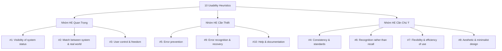
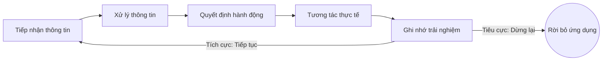

# General Design Skill (Bản hướng dẫn năng lực đánh giá UI/UX nâng cao)

Tài liệu này chứa đựng tri thức, kinh nghiệm và nhãn quan thẩm mỹ của một **Senior Product Designer với hơn 10 năm kinh nghiệm**. Bộ kỹ năng này được thiết kế để các AI Agent đọc, hiểu và sử dụng làm bộ quy chuẩn tối cao trước khi thực hiện đánh giá bất kỳ giao diện người dùng (UI) hoặc luồng trải nghiệm (Flow) nào.

---

## PHẦN 1: CÁC KIẾN THỨC NỀN TẢNG VỀ UI (UI FOUNDATION)

Mọi giao diện chất lượng cao đều được xây dựng chặt chẽ từ các quy tắc thị giác nền tảng sau:

### 1. Typography (Thiết kế Chữ viết)
* **Số lượng cỡ chữ tối đa:** Chỉ sử dụng **tối đa 4 kích thước phông chữ** trên cùng một màn hình (bao gồm: Title, Subtitle/Body, Support, Secondary) để tránh gây nhiễu loạn thị giác và phá vỡ cấu trúc thông tin.
* **Phân loại phông chữ theo mục đích (Font Classification):**
  * **Sans-serif (Không chân):** Kiểu chữ hiện đại, rõ ràng, tối ưu hiển thị tốt nhất trên thiết bị kỹ thuật số. *Bắt buộc dùng cho toàn bộ phần văn bản đọc, nội dung chính, nhãn nhập liệu (labels), và nút bấm.*
  * **Serif (Có chân):** Kiểu chữ trang trọng, cổ điển, truyền thống. *Chỉ dùng cho tiêu đề lớn (Title) của các sản phẩm mang tính thời trang, editorial, nghệ thuật hoặc thương hiệu cao cấp.*
  * **Monospace (Đơn cách):** Tất cả các ký tự chiếm chiều rộng ngang bằng nhau. *Bắt buộc và chỉ dùng để hiển thị mã nguồn (source code) hoặc bảng dữ liệu số phức tạp (giúp các cột số thẳng hàng dọc).*
  * **Handwrite (Viết tay) & Display (Trang trí):** *Chỉ sử dụng cho slogan, logo, Landing Page trang trí.* Tuyệt đối không dùng cho văn bản đọc hoặc các nhãn nút bấm.
* **Readability (Khả năng đọc đoạn văn) vs. Legibility (Tính dễ nhận diện ký tự):**
  * **Readability:** Bị tác động trực tiếp bởi Kích thước phông (Size), Khoảng cách dòng (Leading), Điểm ngắt dòng (Line break), và Cách viết hoa/thường (Case) - *tránh viết hoa toàn bộ (ALL CAPS) đối với các đoạn văn dài*.
  * **Legibility:** Phụ thuộc vào kiểu dáng phông (Font family), Độ đậm (Font weight), Khoảng cách dòng (Leading), và Độ rộng ký tự (Width).
* **Hệ thống phông chữ (System vs. Custom Fonts):**
  * **System Fonts (SF Pro, Roboto, Helvetica):** Nhất quán, đơn giản và quen thuộc.
  * **Custom Fonts:** Chỉ dùng khi cần tạo điểm nhấn thương hiệu độc đáo (giới hạn cho tiêu đề chính/slogan).
* **Độ đậm chữ (Visual Weight):** Sử dụng các sắc độ Bold/Semi-Bold (`font-weight` >= 600) một cách thông minh để kéo mắt người dùng vào tiêu đề chính trước tiên.

### 2. Color (Màu sắc)
* **Quy tắc phân bổ diện tích màu 60/30/10:** 60% Neutrals/Base, 30% Primary brand, 10% Accent/CTA color.
* **Phân loại màu sắc theo chức năng (Functional Colors):**
  * **Primary Color:** Áp dụng cho các hành động chính mang tính chất tiến về phía trước trong quy trình (**Primary Actions** như: *Sign In, Sign Up, Save, Post, Buy Now*).
  * **Secondary Color:** Áp dụng cho các hành động phụ, không ưu tiên hoặc hủy bỏ tác vụ (**Secondary Actions** như: *Cancel, Edit, Skip, Filter, Close, Go Back*).
  * **Semantic Colors (Màu trạng thái):** Phải tuân thủ nghiêm ngặt quy ước: Error (Đỏ), Success (Xanh lá), Warning (Vàng/Cam), Info (Xanh dương).
  * **Neutral Colors (Màu trung tính):** Màu xám, đen, trắng chuyên dùng cho text thông thường, borders, dividers và background.
* **Độ tương phản & Khả năng tiếp cận (Accessibility - WCAG 2.1):**
  * **Chuẩn AA (Bắt buộc phổ biến):** Chữ nhỏ (< 19px) tương phản tối thiểu **4.5:1**; Chữ lớn (>= 19px hoặc chữ bold >= 14px) tương phản tối thiểu **3:1**.
  * **Chuẩn AAA (Khắt khe):** Chữ nhỏ (< 19px) tương phản tối thiểu **7:1**; Chữ lớn (>= 19px) tương phản tối thiểu **4.5:1**.
  * *Nguyên lý đa kênh:* Không bao giờ dùng màu sắc làm phương tiện *duy nhất* để biểu thị trạng thái (ví dụ: thông báo lỗi phải có cả **Màu đỏ + Icon cảnh báo + Văn bản mô tả lỗi**).
* **Trạng thái tương tác (Color States):** Thiết kế nút bấm và các component phải có đủ biến thể màu sắc (bằng cách tinh chỉnh Brightness/Saturation trong hệ HSB) cho các trạng thái: *Active, Hover, Pressed (nhấn giữ), và Disabled (vô hiệu hóa)*.

### 3. Iconography (Biểu tượng)
* **Kích thước tiêu chuẩn:** Luôn xuất bản và căn chỉnh icon trên grid cơ sở là **24x24px** (Vùng vẽ an toàn - **Live area** là **20x20px** và **Padding** xung quanh là **2px**).
* **Tỷ lệ icon tương ứng với text (IBM Standard):**
  * Icon **16x16px** (Stroke **1px**) -> Đi kèm chữ **14pt**.
  * Icon **20x20px** (Stroke **1.25px**) -> Đi kèm chữ **16pt**.
  * Icon **24x24px** (Stroke **1.5px**) -> Kích thước tiêu chuẩn.
  * Icon **32x32px** (Stroke **2px**) -> Sử dụng khi cần kích thước lớn nổi bật.
* **Tính nhất quán:** Sử dụng **không quá 2 styles icon** trên cùng một sản phẩm. Tránh phối hợp lẫn lộn giữa icon nét mỏng (Outline) và icon đặc (Filled) một cách ngẫu nhiên.
* **Quy ước trạng thái sử dụng Style:**
  * **Outline Icons:** Sử dụng cho các trạng thái mặc định, chưa được chọn (**Default/Inactive**).
  * **Filled Icons:** Sử dụng cho trạng thái đang được chọn (**Active/Selected**) để tạo điểm nhấn thị giác rõ rệt.
* **Optical Alignment (Căn chỉnh quang học):** Căn chỉnh các icon không đối xứng (như biểu tượng Play tam giác, icon điện thoại nghiêng) dựa trên cảm nhận thị giác của mắt thay vì căn chỉnh toán học của Bounding Box để tránh cảm giác bị lệch.
* **Vùng tương tác (Touch target size):** Bất kể icon hiển thị kích thước bao nhiêu, vùng bấm thực tế (Clickable/Touch target zone) bắt buộc phải đạt tối thiểu **44x44px (iOS)** hoặc **48x48px (Android)** để chống bấm trượt.

### 4. Visual Design Principles (Nguyên lý trực quan)
* **Visual Weight (Trọng lượng thị giác):** Lực hút thị giác của vật thể lên mắt người dùng được điều phối qua: Kích thước, Màu sắc, Sáng tối, Vị trí, Hình dạng, Chất liệu bề mặt, và Hướng của vật thể.
* **Emphasis (Điểm nhấn):** Làm nổi bật yếu tố quan trọng nhất (CTA chính) so với phần còn lại, hỗ trợ trực tiếp cho mục tiêu hành động (Goal) của màn hình.
* **Hierarchy (Phân cấp thông tin):** Sắp xếp thông tin theo thứ tự ưu tiên quét mắt từ trên xuống dưới (độ lớn, độ đậm, khoảng cách) để người dùng biết thông tin nào quan trọng nhất cần đọc trước, thông tin nào phụ đọc sau.
* **Consistency (Nhất quán):** Functional, Internal, và External Consistency.
* **Gestalt Laws (3 Quy luật cốt lõi trong Layout):** Law of Similarity (Tương đồng), Law of Common Region (Vùng chung), và Law of Proximity (Gần gũi).

### 5. Responsive Web & Grid Layout Rules (Hệ thống lưới web)
* **Mobile-First Design:** Thiết kế cho di động trước để giải quyết ràng buộc hẹp nhất, loại bỏ chi tiết thừa, sau đó mở rộng lên Desktop.
* **Hệ thống mốc điểm gãy (Breakpoints):** Extra Small (< 576px), Small (>= 576px), Medium (>= 768px), Large (>= 992px), Extra Large (>= 1200px), và Extra Extra Large (>= 1400px).
* **Lưới 12 cột (12-Column Grid):** Columns, Gutters (khoảng cách cột), và Margins (lề ngoài). Chia layout linh hoạt.
* **Hành vi lưới (Grid Adaptability):** Fixed Grid, Fluid Grid, và Hybrid Grid.
* **Khoảng trắng tiêu chuẩn (Negative Space):** Lề bên tối thiểu 16px. Spacing grid là bội số của 8px.
* **Nguyên tắc căn chỉnh (Alignment):** Không căn giữa đoạn văn dài > 3 dòng. Cột dữ liệu số (giá tiền, số lượng) bắt buộc phải **căn lề phải (Right-align)**. List đối tượng căn giữa dọc, chevron nằm sát lề phải.

### 6. Web Elements & Component Standards (Thành phần Web)
* **Button Standards (Tiêu chuẩn Nút):** Nhãn nút bắt buộc sử dụng động từ hành động. Variants: Primary, Secondary, Tertiary, Danger, Ghost.
* **Thành phần Điều hướng (Navigation):** Breadcrumbs (>= 3 cấp), Drawer (Sidebar), Stepper, Tabs, và Pagination (có items per page).
* **Thành phần Nhập liệu (Data Input):** Text Field size (Large 40px, Default 32px, Small 24px), Select, Autocomplete, Form Controller.
* **Phân loại cấu trúc phần tử phụ:** Data Display (Avatars, Badges, Tags, Tooltips) vs. Feedback (Alerts, Snackbars, Dialogs).

### 7. Mobile App Design Standards (Tiêu chuẩn Thiết kế Mobile)
* **Launch Screen (Màn hình Splash):** Đồng bộ trực quan với App Icon. Tối giản, cấm quảng cáo/animations dài.
* **Navigation Bars (Top Nav):** Tiêu đề siêu ngắn gọn. Icon quay lại đơn giản (`<` + tên trang trước).
* **Tab Bars (Thanh điều hướng dưới):** Chỉ dùng cho điều hướng, cấm nút hành động. Giới hạn 3-5 tabs.
* **Sidebars (Drawers) trên Mobile:** Giới hạn tối đa 2 cấp phân cấp.
* **Modality (Modal Sheets):** Dùng cho luồng phụ phức tạp. Cung cấp nút Cancel/Done. Confirmation Alert bắt buộc nếu tắt modal khi dữ liệu đang nhập dở.
* **Permission Requests (Yêu cầu quyền):** Giải thích lý do trước khi gọi popup native. Fallback hướng dẫn mở Settings nếu bị từ chối.
* **Touch Target (Vùng chạm di động):** Vùng tương tác thực tế tối thiểu đạt **44x44pt (iOS)** hoặc **48x48dp (Android)**.
* **Độ phân giải cơ sở:** Thiết kế trên Points: **375x812 pt** hoặc **390x844 pt**, sử dụng phông chữ SF Pro (iOS).

---

## PHẦN 2: CÁC KIẾN THỨC NỀN TẢNG VỀ UX (UX FOUNDATION)

Đánh giá trải nghiệm người dùng nâng cao bao gồm hai cấu phần chính: **Đánh giá Heuristic dựa trên kinh nghiệm chuyên gia** và **Đánh giá tính khả dụng thực tế (Usability Testing)**.

---

### A. 10 NGUYÊN LÝ HEURISTICS CỦA JAKOB NIELSEN (NNGROUP)



#### 1. Nhóm HE Quan Trọng (Critical Group)
Quyết định việc người dùng có định hướng được hệ thống và tin cậy sản phẩm hay không.
* **Heuristic #1: Visibility of system status (Trực quan hóa trạng thái hệ thống):**
  * *Nguyên lý:* Luôn giữ người dùng được cập nhật về những gì đang xảy ra, thông qua các phản hồi (feedback) phù hợp trong một khoảng thời gian hợp lý (Doherty Threshold < 400ms).
  * *Quy chuẩn:* Phản hồi tương tác ngay lập tức (click button có active/loading state); Hiển thị progress bar/shimmer khi tác vụ tốn thời gian; Mọi button phải có đủ các trạng thái (*Normal, Hover, Active/Pressed, Focused, Disabled, Loading*).
* **Heuristic #2: Match between system and the real world (Tương thích với thế giới thực):**
  * *Nguyên lý:* Nói ngôn ngữ của người dùng (ngôn từ, khái niệm quen thuộc) thay vì dùng thuật ngữ kỹ thuật. Thông tin phải xuất hiện theo trình tự tự nhiên và hợp logic đời thực.
  * *Quy chuẩn:* Loại bỏ mã lỗi kỹ thuật; Thiết kế tương thích với Mental Model (mô hình tư duy) thực tế của người dùng; Sử dụng ẩn dụ vật lý phù hợp (thùng rác để xóa, kéo thả sắp xếp layout).
* **Heuristic #3: User control and freedom (Quyền kiểm soát và tự do):**
  * *Nguyên lý:* Người dùng thường xuyên thao tác nhầm lẫn. Họ cần một "lối thoát hiểm khẩn cấp" (emergency exit) để quay lại ngay mà không phải qua các bước phức tạp.
  * *Quy chuẩn:* Nút Undo, Redo, Cancel, Close (X) phải hiển thị rõ ràng, dễ tìm; Cho phép hoàn tác nhanh (ví dụ: toast hoàn tác gửi tin nhắn); Cho phép hủy quy trình dài ở bất kỳ bước nào.

#### 2. Nhóm HE Cần Thiết (Essential Group)
Bảo vệ người dùng khỏi các sai sót và cung cấp sự hỗ trợ khi gặp vấn đề.
* **Heuristic #5: Error prevention (Phòng ngừa lỗi):**
  * *Nguyên lý:* Ngăn ngừa lỗi xảy ra ngay từ đầu. Loại bỏ các điều kiện dễ gây lỗi hoặc kiểm tra chúng và đưa ra cảnh báo xác nhận trước khi người dùng thực thi hành động.
  * *Quy chuẩn (3 lớp phòng thủ chống lỗi):*
    1. *Ngăn lỗi (Prevent):* Khóa nút Submit (disabled) nếu thiếu thông tin bắt buộc; Thiết kế các khớp cắm vật lý chống cắm ngược (như USB Type-C).
    2. *Nhận biết lỗi (Recognize):* Cảnh báo theo thời gian thực (inline validation) khi nhập sai định dạng email/mật khẩu.
    3. *Xác nhận:* Hiển thị Confirmation Dialog trước hành động nguy hiểm không thể đảo ngược (như xóa file).
* **Heuristic #9: Help users recognize, diagnose, and recover from errors (Nhận biết, chẩn đoán và khắc phục lỗi):**
  * *Nguyên lý:* Khi có lỗi xảy ra, thông báo lỗi phải được diễn đạt bằng ngôn ngữ tự nhiên, chỉ rõ chính xác vấn đề nằm ở đâu, và đề xuất một giải pháp khắc phục cụ thể.
  * *Quy chuẩn:* Tuyệt đối không dùng mã lỗi lập trình; Báo lỗi ngay tại trường xảy ra lỗi (inline error) thay vì báo chung ở đầu trang; Luôn đi kèm giải pháp khắc phục (ô mật khẩu sai hiện link *"Quên mật khẩu?"*, viết tweet quá dài hiện âm ký tự và bôi đỏ).
* **Heuristic #10: Help and documentation (Trợ giúp và tài liệu hướng dẫn):**
  * *Nguyên lý:* Tốt nhất là hệ thống tự giải thích được. Tuy nhiên, tài liệu vẫn cần thiết để giúp người dùng hiểu cách hoàn thành tác vụ.
  * *Quy chuẩn:*
    * *Hỗ trợ chủ động (Proactive Help):* Onboarding tutorials, contextual tips (tooltips, inline helper text).
    * *Hỗ trợ thụ động (Reactive Help):* Help desk, tài liệu hướng dẫn (FAQ/Knowledge Base) có thanh tìm kiếm, video tutorials.

#### 3. Nhóm HE Cần Chú Ý (Secondary/Attention Group)
Nâng cao tính nhất quán, tốc độ và thẩm mỹ chuyên nghiệp cho hệ thống.
* **Heuristic #4: Consistency and standards (Sự nhất quán và tiêu chuẩn):**
  * *Nguyên lý:* Đồng nhất ngôn từ, tình huống và hành động trên giao diện. Tuân thủ quy ước chung của nền tảng và ngành.
  * *Quy chuẩn:* Nhất quán 3 cấp độ (ngoại vi, nội bộ, chức năng); Quy ước nút chọn (Radio: chọn 1 trong các tùy chọn loại trừ; Checkbox: chọn nhiều, tích/bỏ tích dễ dàng); Tránh nhất quán cực đoan gây khó phân biệt (như các icon cùng màu của Google).
* **Heuristic #6: Recognition rather than recall (Nhận biết thay vì nhớ lại):**
  * *Nguyên lý:* Giảm thiểu tải nhớ của người dùng bằng cách hiển thị trực quan các đối tượng, hành động và tùy chọn. Không bắt nhớ thông tin từ màn hình này sang màn hình khác.
  * *Quy chuẩn:* Hiển thị phím tắt bên cạnh công cụ (như Figma); Dùng menu gợi ý hoặc phím tắt gợi ý (Notion dùng `/` gọi block); Lưu lịch sử tìm kiếm gần đây; Google highlight màu tím cho các link đã click trước đó.
* **Heuristic #7: Flexibility and efficiency of use (Sự linh hoạt và hiệu quả):**
  * *Nguyên lý:* Cung cấp công cụ tăng tốc (Shortcuts) ẩn với người dùng mới nhưng giúp ích cho người dùng chuyên nghiệp. Cho phép người dùng tùy biến giao diện.
  * *Quy chuẩn:* Hỗ trợ keyboard shortcuts, chuột phải, gestures (vuốt 3 ngón tay để undo); Cho phép tùy biến khu vực tiện ích nhanh (Techcombank/MoMo cho chọn phím tắt ra trang chính); Hỗ trợ các Widgets và Workspaces chuyên biệt.
* **Heuristic #8: Aesthetic and minimalist design (Tối giản và thẩm mỹ):**
  * *Nguyên lý:* Loại bỏ các thông tin không liên quan hoặc hiếm khi cần đến. Mỗi thông tin thừa sẽ cạnh tranh sự chú ý và làm giảm khả năng nhận diện thông tin chính.
  * *Quy chuẩn:* Tối đa hóa tỷ lệ Tín hiệu/Nhiễu (Signal-to-noise Ratio) - ví dụ: trang chủ Google tối giản triệt tiêu nhiễu tốt hơn Yahoo; Ẩn các bộ lọc nâng cao vào "Advanced Search"; Ứng dụng hiệu ứng Aesthetic-Usability Effect để tăng trải nghiệm thẩm mỹ.

---

### B. KHUNG ĐÁNH GIÁ TRẢI NGHIỆM KHẢ DỤNG (USABILITY TESTING & THE DCOL FRAMEWORK)

Đánh giá trải nghiệm khả dụng thực tế của một giao diện/luồng tác vụ không chỉ dừng lại ở các nguyên lý tĩnh, mà đòi hỏi sự thấu hiểu sâu sắc về cách thức nghiên cứu, đo lường hành vi thực tế của người dùng qua **Usability Testing (UT)**.

#### 1. Định nghĩa và Vai trò cốt lõi của Usability Testing (UT)
* **Định nghĩa:** Usability Testing là phương pháp nghiên cứu định tính hoặc định lượng nhằm đánh giá mức độ dễ sử dụng của một sản phẩm bằng cách quan sát người dùng thực hiện các tác vụ cụ thể và ghi lại các phản hồi, hành vi, lỗi thao tác của họ.
* **Vai trò:**
  * Phát hiện các lỗi usability ẩn mà thiết kế tĩnh khó nhận thấy (ví dụ: người dùng lúng túng trước các gesture swipe mà không có chỉ dẫn).
  * Đo lường hiệu quả khả dụng của hệ thống qua thời gian.
  * So sánh hiệu quả trải nghiệm của sản phẩm với các đối thủ cạnh tranh trên thị trường (benchmarking).
* **Phân biệt UT và IDI (In-depth Interview):**
  * **Usability Testing (UT):** Tập trung vào **Hành vi (Behavioral)**. Quan sát trực tiếp người dùng *làm gì* trên giao diện (what they do), đo lường mức độ thành công của tác vụ.
  * **In-depth Interview (IDI):** Tập trung vào **Thái độ/Quan điểm (Attitudinal)**. Khai thác sâu về *cảm xúc, mong muốn, nhu cầu, động cơ và suy nghĩ* của họ (what they say).

#### 2. Các chỉ số đo lường Usability (Metrics) & SUS Score
* **System Usability Scale (SUS):** Thang đo chuẩn hóa để đánh giá cảm nhận về độ khả dụng của hệ thống gồm 10 câu hỏi chuẩn, cho ra điểm số từ 0 - 100.
  * *Mốc chấp nhận (Acceptability Scale):*
    * **Acceptable (Chấp nhận được):** SUS >= 70 (Điểm trung bình tiêu chuẩn ngành là 68). Điểm từ 85.5 trở lên được xếp hạng **Excellent (Xuất sắc)**.
    * **Marginal (Biên giới/Cận biên):** SUS từ 50 - 69. Hệ thống cần được cải thiện gấp.
    * **Not Acceptable (Không thể chấp nhận):** SUS < 50. Hệ thống cực kỳ khó dùng, cần tái thiết kế toàn diện.

#### 3. Các giai đoạn thực hiện UT trong Vòng đời Sản phẩm (Product Lifecycle)
* **Giai đoạn Thiết kế (Product Design):**
  * *Early Stage UT:* Kiểm tra các bản phác thảo, lo-fi wireframe hoặc concept ban đầu để định hình hướng đi.
  * *Before Development UT:* Test trên các bản hi-fi prototype tương tác trước khi bàn giao cho đội ngũ lập trình để tránh lãng phí nguồn lực code.
* **Giai đoạn Phát triển (Product Development):**
  * *Before Release UT:* Đánh giá phiên bản Beta/Staging hoàn thiện để lọc sạch các lỗi UX cuối cùng trước khi đưa ra thị trường.
* **Giai đoạn Tăng trưởng (Product Growth):**
  * *Regular Check-in UT:* Kiểm tra định kỳ sản phẩm đang vận hành để tối ưu hóa liên tục hiệu suất chuyển đổi và nâng cấp các tính năng mới.

#### 4. Phân loại các Phương pháp Usability Testing & Ma trận Lựa chọn
Tùy thuộc vào mục tiêu nghiên cứu và giai đoạn sản phẩm, ta lựa chọn phương pháp kiểm thử phù hợp:
* **Không gian kiểm thử:**
  * *In-person (Trực tiếp):* Nghiên cứu viên và đáp viên ngồi cùng một phòng. Tối ưu khi cần quan sát sâu sắc ngôn ngữ cơ thể, cử chỉ tay trên thiết bị thực tế.
  * *Remote (Từ xa):* Thực hiện qua các công cụ video call (Zoom, Teams, Meet). Tối ưu về mặt chi phí và khả năng tuyển đáp viên ở nhiều vị trí địa lý khác nhau.
* **Vai trò của Nghiên cứu viên:**
  * *Moderated (Có điều phối viên):* Có người hướng dẫn, đặt câu hỏi gợi mở, quan sát và hỗ trợ đáp viên khi họ bị kẹt. Rất tốt cho nghiên cứu khám phá sâu (Qualitative).
  * *Unmoderated (Không điều phối viên):* Đáp viên tự hoàn thành nhiệm vụ trên một nền tảng tự động (ví dụ: Maze). Tối ưu khi cần thu thập dữ liệu với số lượng mẫu lớn (Quantitative).
* **Bản chất dữ liệu:**
  * *Qualitative (Định tính):* Thu thập thông tin phi số học (biểu cảm bối rối, suy nghĩ thành lời - think-aloud, lý do thao tác sai). Mục tiêu là tìm ra *Tại sao (Why)* có vấn đề khả dụng.
  * *Quantitative (Định lượng):* Đo lường các chỉ số số học (tỷ lệ thành công tác vụ - Task Success Rate, thời gian hoàn thành - Time on Task, số lượng lỗi click sai - Misclick Rate). Mục tiêu là biết *Bao nhiêu (How much/many)*.

##### Ma trận case-study thực tế khi chọn phương án UT:
1. **Case 1 (Tính năng mới chuyên biệt):** Techcombank vừa hoàn thành tính năng chuyển tiền từ nước ngoài về Việt Nam. Cần kiểm tra xem người dùng có gặp khó khăn gì khi thao tác không.
   * *Lựa chọn tối ưu:* **Remote - Moderated - Qualitative**. Vì người dùng ở nước ngoài (phải làm Remote), cần quan sát sâu hành vi tương tác và hỏi nguyên nhân khi họ bối rối (Moderated & Qual).
2. **Case 2 (Tối ưu hóa hiệu suất):** Grab phát hành tính năng đặt đồ ăn từ khách sạn 5 sao. Muốn đánh giá tốc độ đặt hàng và tỷ lệ thao tác lỗi của người dùng thay đổi thế nào sau 1 tháng.
   * *Lựa chọn tối ưu:* **Remote - Unmoderated - Quantitative**. Vì mục tiêu là đo lường các chỉ số cụ thể (tốc độ, số lỗi) trên tập người dùng lớn sau thời gian vận hành.
3. **Case 3 (Giao diện B2B chuyên dụng):** EzCloud phát hành app check-in nhanh trên iPad cho lễ tân khách sạn. Cần kiểm tra xem lễ tân có gặp vấn đề tương tác trực tiếp tại quầy không.
   * *Lựa chọn tối ưu:* **In-person - Moderated - Qualitative**. Vì cần quan sát thực địa tại quầy lễ tân (iPad đặt cố định hoặc cầm tay), sự phân tâm của lễ tân khi tương tác với khách hàng thật ngoài đời.

#### 5. Khung đánh giá 4 Trụ cột UX (DCOL Framework)
Khi thực hiện đánh giá bất kỳ luồng giao diện nào, Agent phải phân tích kỹ lưỡng thông qua lăng kính của 4 trụ cột DCOL:
* **Trụ cột 1: Discoverability (Khả năng tìm thấy/nhận biết):**
  * *Câu hỏi cốt lõi:* Người dùng có thực sự nhìn thấy hoặc tìm thấy các tính năng, nút bấm, hay thông tin quan trọng trên màn hình không? 
  * *Điểm đánh giá:* Vị trí đặt CTA chính (nằm ở tiêu điểm quét mắt hay bị khuất), độ tương phản của nút bấm so với nền, kích thước icon, khoảng cách (white space) xung quanh phần tử.
* **Trụ cột 2: Comprehension (Khả năng đọc hiểu/nhận thức):**
  * *Câu hỏi cốt lõi:* Người dùng có hiểu ý nghĩa của thông tin, thuật ngữ, biểu tượng trên màn hình và biết mình cần phải thực hiện bước tiếp theo như thế nào không?
  * *Điểm đánh giá:* Wording trên nhãn nút (Label - có sử dụng động từ hành động không), tính rõ ràng của placeholder và helper text trong Input field, tính phổ quát của icon (icon có quá dị biệt không).
* **Trụ cột 3: Orientation (Khả năng định hướng vị trí):**
  * *Câu hỏi cốt lõi:* Người dùng có biết mình đang ở đâu trong cấu trúc phân cấp của ứng dụng không? Họ có biết cách để tiếp tục tiến lên phía trước hoặc quay lại trang trước một cách dễ dàng không?
  * *Điểm đánh giá:* Sự hiện diện của Breadcrumbs (trên web), sự trực quan của nút Back (trên mobile), trạng thái Active rõ rệt trên thanh Navigation/Tab bar.
* **Trụ cột 4: Learnability (Khả năng học hỏi/ghi nhớ):**
  * *Câu hỏi cốt lõi:* Mặc dù người dùng có thể gặp khó khăn ở lần tương tác đầu tiên, họ có dễ dàng học được cách vận hành và ghi nhớ cách sử dụng cho những lần sau không?
  * *Điểm đánh giá:* Việc áp dụng các UI Design Patterns chuẩn của ngành (ví dụ: icon giỏ hàng ở góc trên bên phải), phản hồi lỗi mang tính xây dựng cao để người dùng tự sửa đổi.

#### 6. Quy tắc xây dựng Bối cảnh & Kịch bản Tác vụ (Task Scenarios Rules)
Khi mô phỏng hành vi người dùng để đánh giá UI, Agent phải tuân thủ nghiêm ngặt quy tắc viết kịch bản tác vụ chuẩn UX Research:
1. **Thực tế & Gần gũi (Realistic & Contextual):** Bối cảnh phải đặt đáp viên vào một tình huống thực tiễn có mục đích rõ ràng trong đời sống của họ.
2. **Tập trung vào Hành động (Action-Oriented):** Đưa ra một nhiệm vụ cụ thể để người dùng hoàn thành, tuyệt đối không hỏi chung chung dạng lý thuyết kiểu họ sẽ làm gì.
3. **Tuyệt đối không đưa gợi ý (No Hints/No Clues):** **Tuyệt đối cấm** sử dụng các từ khóa nhãn giao diện (UI labels) hoặc liệt kê các bước bấm nút trong kịch bản. Điều này làm mất đi tính tự nhiên và làm sai lệch kết quả test.
   * *Ví dụ sai (Có gợi ý):* "Bạn hãy click vào mục [Chuyển tiền nhanh 24/7], nhập số tài khoản, chọn ngân hàng rồi bấm [Tiếp tục] để chuyển khoản."
   * *Ví dụ đúng (Chuẩn UX):* "Tết sắp đến, bạn đang ở quê nhà và muốn gửi lì xì may mắn trị giá 1,500,000 VND cho người thân bằng ứng dụng ngân hàng của mình. Bạn hãy thực hiện tác vụ trên."

---

### C. TÂM LÝ HỌC HÀNH VI & SỰ CHÚ Ý (UX PSYCHOLOGY & ATTENTION MECHANISM)

Để đánh giá một thiết kế giao diện có hoạt động hiệu quả hay không, AI Agent phải hiểu được cơ chế vận hành tâm lý học đằng sau cách người dùng tiếp nhận thông tin, ra quyết định và phân bổ sự chú ý của họ.

#### 1. Hệ thống Tư duy Nhanh & Chậm (Daniel Kahneman - Thinking, Fast and Slow)
Bộ não con người vận hành song song hai hệ thống tư duy với cơ chế phân bổ năng lượng khác nhau:
* **Hệ thống 1 (Tư duy Nhanh - Fast Thinking):**
  * *Bản chất:* Vô thức, tự động, chớp nhoáng, không tốn nỗ lực và năng lượng.
  * *Tỉ lệ:* Chiếm **95% - 98%** tổng hoạt động tư duy hàng ngày.
  * *Cơ chế:* Hoạt động dựa trên các lối tư duy tắt (**Mental shortcuts**) và thói quen tích lũy từ trước để đưa thẳng đến kết quả mà không cần suy nghĩ logic.
  * *Ứng dụng thiết kế:* Giao diện cần trực quan tối đa để phục vụ Hệ thống 1 (ví dụ: các nút hành động khẩn cấp/nguy hiểm phải đi kèm cảnh báo xác nhận rõ ràng, các icon chức năng thông dụng được đặt ở vị trí quen thuộc).
* **Hệ thống 2 (Tư duy Chậm - Slow Thinking):**
  * *Bản chất:* Có ý thức, chậm chạp, đòi hỏi sự tập trung cao độ, phân tích logic và tiêu tốn nhiều năng lượng não bộ.
  * *Tỉ lệ:* Chiếm phần rất nhỏ trong ngày. Chỉ được kích hoạt khi con người gặp các tác vụ phức tạp (ví dụ: tính nhẩm $31 \times 23$, điền các mẫu form khai báo dài, thiết lập hệ thống phức tạp).
  * *Sai lầm thiết kế thường gặp:* Thiết kế các hệ thống quá phức tạp, logic máy móc bắt ép người dùng phải vận dụng Hệ thống 2 liên tục, gây mệt mỏi và làm họ rời bỏ ứng dụng.

#### 2. Vòng lặp phản hồi Tương tác (UX Feedback Loop)
Bất kỳ tương tác nào của người dùng trên giao diện cũng trải qua một chu kỳ phản hồi khép kín:

* Muốn người dùng "sử dụng không ngừng", sản phẩm phải mang lại kết quả trải nghiệm tích cực tại bước **Ghi nhớ (Retention)** để củng cố động lực cho vòng lặp tiếp theo. Nếu bước tương tác dẫn tới kết quả tiêu cực (lỗi hệ thống, giao diện rối rắm), họ sẽ ghi nhớ sự ức chế và dừng sử dụng.

#### 3. Cơ chế Chú ý Chọn lọc (Selective Attention)
* **Khái niệm:** Do não bộ có cơ chế tự động tiết kiệm năng lượng, người dùng sẽ tự động giảm tải (lờ đi) các thông tin gây nhiễu xung quanh để dồn toàn bộ sự tập trung vào nhiệm vụ hiện tại (ví dụ: khi đang vội đi qua đường, bạn chỉ chú ý đến xe cộ và lờ đi hoàn toàn các biển quảng cáo).
* **Ứng dụng thiết kế:** Thiết kế tốt là thiết kế loại bỏ tối đa các yếu tố làm phân tâm, hỗ trợ người dùng đạt được mục tiêu tác vụ một cách mượt mà nhất.

#### 4. Thứ con người CHÚ Ý (Não bộ bị thu hút mạnh mẽ)
Não bộ sinh học của chúng ta được lập trình để nhạy cảm đặc biệt với 4 nhóm thông tin sau:
1. **Thông tin liên quan (Relevant):** Những gì đáp ứng trực tiếp mục tiêu hoặc thứ họ đang tìm kiếm trên màn hình.
2. **Mối nguy hiểm/Mối đe dọa (Danger/Threats):** Bản năng sinh tồn giúp con người nhận diện cực nhanh các yếu tố báo động thông qua:
   * *Màu sắc:* Đặc biệt nhạy cảm với **Màu Đỏ** (sử dụng tối ưu cho các cảnh báo lỗi, nút xóa dữ liệu quan trọng).
   * *Kích thước:* Các phần tử có kích thước lớn đột biến.
   * *Chuyển động (Motion):* Các hiệu ứng animation, popup nhảy ra đột ngột thu hút mắt tức thì (nhưng dễ gây ức chế nếu lạm dụng).
3. **Khuôn mặt & Sự hấp dẫn giới tính:** Mắt người tự động bị hút vào hình ảnh chân dung người thật hoặc khuôn mặt cười trên các banner quảng cáo.
4. **Lợi ích/Phần thưởng (Rewards):** Các chương trình khuyến mãi, voucher giảm giá, phần quà hời kích thích trực tiếp lòng tham và sự tò mò.

#### 5. Thứ con người LỜ ĐI (Bộ não tự động bỏ qua)
Để bảo toàn năng lượng, bộ não sẽ triệt tiêu sự chú ý đối với các nhóm thông tin:
1. **Thông tin không liên quan (Irrelevant):** Các thông báo pop-up đòi cấp quyền, khảo sát hoặc banner beNow hiện lên đột ngột khi người dùng đang thực hiện một tác vụ khẩn cấp khác (như đặt xe). Họ sẽ bấm đóng ngay mà không đọc.
2. **Thông tin quá phức tạp (Complex):** Các giao diện chi chít chữ (như trang web hành chính công), tài liệu dài dằng dặc (Hiệu ứng *tl;dr - too long; didn't read*), hoặc hình ảnh có background quá dày đặc gây rối mắt. Người dùng sẽ bỏ qua để tìm lối tắt nhanh hơn.
3. **Thông tin lặp đi lặp lại nhiều lần (Repetitive):** Gây ra hiệu ứng **Mù Banner (Banner Blindness)**. Người dùng tự động bỏ qua toàn bộ khu vực phía trên hoặc hai bên của website vì mặc định các vị trí đó chỉ chứa quảng cáo rác (ví dụ: khu vực quảng cáo trên CafeF), bất kể nội dung ở đó có nhấp nháy hay to lớn thế nào.

---

### D. TẢI NHẬN THỨC & CÁC PHƯƠNG PHÁP GIẢM TẢI (COGNITIVE LOAD & DECISION MINIMIZATION)

Khả năng xử lý thông tin của bộ não con người tại một thời điểm có giới hạn vật lý nghiêm ngặt. Nhiệm vụ cốt lõi của UX Design là bảo vệ giới hạn này để tránh gây ức chế cho người dùng.

#### 1. Khái niệm về Tải Nhận Thức (Cognitive Load)
* **Định nghĩa:** Cognitive Load là tổng lượng năng lượng và tài nguyên trí tuệ (giống như dung lượng RAM của máy tính) cần thiết để người dùng xử lý thông tin và hoàn thành một tác vụ trên giao diện.
* **Quá tải nhận thức (Cognitive Overload):** Xảy ra khi giao diện bắt người dùng phải chú ý và xử lý quá nhiều thông tin hỗn loạn cùng một lúc. Hậu quả trực tiếp là não bộ phản ứng chậm hơn, người dùng nhanh chóng mệt mỏi, mất tập trung, dễ mắc sai lầm hoặc đưa ra quyết định sai.
* **Nguyên lý "Đừng bắt tôi phải nghĩ" (Don't Make Me Think - Steve Krug):**
  * Thiết kế khả dụng là thiết kế mà người dùng có thể hiểu ngay mục đích và cách dùng mà không cần suy nghĩ logic.
  * *Cách đo lường tải nhận thức:* Đếm tổng số câu hỏi tự phát xuất hiện trong đầu người dùng khi họ nhìn vào giao diện (ví dụ: *"Trang này là gì?", "Tôi phải bấm vào đâu?", "Cái nút này có nghĩa là gì?", "Mục này có liên quan gì đến tôi không?"*). Càng nhiều câu hỏi, thiết kế càng tệ.

#### 2. Các phương pháp giảm tải nhận thức tối ưu
Để tối ưu hóa năng lượng xử lý của não bộ Hệ thống 1, thiết kế phải áp dụng các chiến lược sau:

* **Thiết kế theo Mô hình tư duy (Mental Model):**
  * *Mental Model:* Là tập hợp hiểu biết, kỳ vọng và kinh nghiệm có sẵn của người dùng từ các sản phẩm khác ngoài đời thực để áp dụng cho sản phẩm mới.
  * *Case-study thất bại điển hình:* Năm 2016, hãng xe Fiat Chrysler thay đổi thiết kế cần số truyền thống sang dạng cần số điện tử mới. Thiết kế này vi phạm nghiêm trọng Mental Model của tài xế (họ đẩy cần số nhưng xe không vào đúng số mong đợi vì thiếu phản hồi cơ học rõ rệt), dẫn đến việc thu hồi 1.1 triệu xe sau hơn 100 vụ tai nạn.
  * *Quy chuẩn:* Sử dụng các mẫu thiết kế (Design Patterns) quen thuộc của ngành. Ví dụ: Luồng đặt đồ ăn của Grab và Gojek sử dụng chung mô hình lưới danh mục món, thanh tìm kiếm ở đầu và nút giỏ hàng ở dưới để người dùng không mất thời gian học lại cách dùng.
* **Tuân thủ Tính nhất quán & Tiêu chuẩn (Consistency & Standard - HE#4):**
  * Giữ nguyên vị trí các yếu tố điều hướng cốt lõi và các quy ước chung của nền tảng (ví dụ: Logo ở góc trên bên trái trỏ về trang chủ; Icon giỏ hàng ở góc trên bên phải).
* **Áp dụng Định luật Hick (Hick's Law - Giảm thiểu lựa chọn):**
  * *Nội dung:* Càng có nhiều sự lựa chọn, người dùng càng mất nhiều thời gian để đưa ra quyết định.
  * *Quy chuẩn:* Giới hạn số lượng lựa chọn cùng một lúc. **Không nên vượt quá 7 (± 2) lựa chọn**, tốt nhất nên khu trú lại **dưới 5 lựa chọn**. 
  * *Ví dụ:* Ẩn bớt các danh mục phụ dưới nút "Show all / Xem thêm" (như danh mục sản phẩm của Stripe); cung cấp bộ lọc thông minh (Filter) trên các trang đặt phòng (Agoda, Airbnb) để người dùng nhanh chóng thu hẹp hàng ngàn kết quả xuống còn vài lựa chọn chất lượng.
* **Chia nhỏ thông tin (Information Chunking & Progressive Disclosure):**
  * **Chunking (Nhóm thông tin):** Chia các khối thông tin dài, rời rạc thành các cụm nhỏ có nghĩa để dễ nhớ và quét mắt.
    * *Số thẻ tín dụng:* Thay vì hiển thị `4000123418888888`, bắt buộc phải nhóm thành `4000 - 1234 - 1888 - 8888`.
    * *Mã xác thực (OTP):* Chia thành từng ô nhập ký tự riêng biệt (ví dụ: `[ 6 ] [ 2 ] [ 3 ] [ 8 ] [ 7 ]`).
    * *Cấu trúc trang Cài đặt (Settings):* Tránh liệt kê danh sách dài vô tận; hãy nhóm thành các cụm riêng biệt như Cài đặt kết nối, Cài đặt chung, Quyền riêng tư (như iOS Settings).
  * **Progressive Disclosure (Hiển thị lũy tiến):** Chỉ hiển thị những thông tin tối thiểu cần thiết tại thời điểm hiện tại, ẩn các chi tiết nâng cao cho đến khi người dùng chủ động yêu cầu.
    * *Công cụ thực hiện:* Sử dụng Accordion (cho FAQ), Steppers, Tabs, hoặc nút toggle ẩn/hiện thông tin chi tiết.
  * **Conversational Design (Thiết kế dạng hội thoại):** Chia các form đăng ký/khảo sát dài dòng thành các màn hình hỏi-đáp từng bước một cách tự nhiên (ví dụ: Duolingo chia nhỏ quy trình thiết lập mục tiêu học tập thành 4-5 bước tương tác đơn giản).
* **Nhận biết thay vì Nhớ lại (Recognition over Recall - HE#6):**
  * Não bộ nhận diện hình ảnh tốt hơn việc phải nhớ lại ký ức.
  * *Ứng dụng:* Suggest lịch sử tìm kiếm gần đây (Spotify, Shopee); hiển thị danh sách sản phẩm vừa xem (Recently viewed trên Amazon, Lazada); tự động gợi ý bạn bè thường xuyên tương tác khi chia sẻ ảnh (Instagram).
* **Tận dụng Sức mạnh của Hình ảnh & UX Writing:**
  * *Mô tả trực quan (Show, don't tell):* Một hình ảnh đáng giá ngàn lời nói. Hãy dùng hình minh họa hoặc video ngắn thay vì các đoạn văn mô tả dài dòng (ví dụ: trang hướng dẫn dùng Excel hay Figma kết hợp ảnh chụp màn hình/video gif sinh động).
  * *UX Writing:* Sử dụng từ ngữ ngắn gọn, rõ ràng, trực diện, không dùng từ mơ hồ kỹ thuật.
  * *Nhãn cho Icon:* Với các icon không mang tính phổ quát toàn cầu (như icon cài đặt, tìm kiếm, giỏ hàng đã quá quen thuộc), bắt buộc phải có nhãn chữ (Title/Label) đi kèm bên dưới để giải nghĩa.

#### 3. Các trường hợp ngoại lệ cần TĂNG Tải Nhận Thức (Intentional Overload)
Không phải lúc nào giảm tải nhận thức cũng tốt. Có những trường hợp đặc biệt thiết kế bắt buộc phải tăng Cognitive Load để phục vụ mục tiêu sản phẩm:
1. **Thiết kế Game (đặc biệt là Game giải đố):** Cần tăng tải nhận thức và tạo ra các chướng ngại vật trí tuệ để đem lại cảm giác thử thách, thú vị và thỏa mãn cho người chơi khi vượt qua.
2. **Yêu cầu Bảo mật & An toàn (Security & Friction):**
   * Bắt người dùng tạo mật khẩu phức tạp (gồm chữ hoa, chữ thường, số, ký tự đặc biệt) để tránh bị hack tài khoản dễ dàng.
   * Tạo ra lực cản chủ đích (**Friction**) để người dùng dừng lại suy nghĩ kỹ trước các thao tác nguy hiểm khó đảo ngược (ví dụ: bắt gõ chữ "DELETE" hoặc trả lời câu hỏi bảo mật trước khi xóa vĩnh viễn tài khoản).
3. **Trình diễn sự Sáng tạo & Nghệ thuật (Showcase/Awwwards portfolio):** Các trang web nghệ thuật, triển lãm số có thể sử dụng các layout phá cách, phi truyền thống để tạo ấn tượng mạnh về mặt thị giác và phong cách thương hiệu độc bản.

---

### E. MÔ HÌNH HÀNH VI FOGG & CHIẾN LƯỢC TẠO ĐỘNG LỰC (FOGG BEHAVIOR MODEL & MOTIVATION STRATEGY)

Để tác động và thay đổi hành vi người dùng, giúp họ thực hiện hành động mong muốn của sản phẩm, AI Agent cần nắm vững mô hình hành vi Fogg và các hiệu ứng tâm lý học tạo động lực.

#### 1. Mô hình hành vi Fogg (BJ Fogg - Stanford University)
* **Công thức cốt lõi:** 
  $$B = M \times A \times P$$
  Một hành vi (**B**ehavior) chỉ xảy ra khi hội tụ đủ 3 yếu tố tại cùng một thời điểm: Động lực (**M**otivation), Khả năng thực hiện (**A**bility), và Lời nhắc (**P**rompt/Trigger).
* **Đường hành động (Action Line):**
  * *Trên Action Line:* Khi động lực đủ cao và hành vi đủ dễ, lời nhắc (Prompt) xuất hiện sẽ kích hoạt hành vi **chắc chắn xảy ra**.
  * *Dưới Action Line:* Khi động lực quá thấp hoặc hành vi quá khó, lời nhắc (Prompt) xuất hiện sẽ **thất bại** và bị lờ đi.

#### 2. Chiến lược tạo Động lực ở cấp độ Hệ thống/Sản phẩm (System Level)
Để xây dựng sự gắn kết lâu dài, sản phẩm số cần thiết lập các mô hình tạo động lực cốt lõi:
* **Mô hình Freemium (Miễn phí kết hợp Trả phí):**
  * Cung cấp giá trị sử dụng miễn phí liên tục cho các tác vụ cơ bản và kích thích người dùng trả phí để mở khóa các đặc quyền cao cấp (Premium).
  * *Ứng dụng:* Thích hợp cho các app sử dụng hàng ngày như Spotify (nghe nhạc free có quảng cáo vs. Premium offline), Tinder (free quẹt giới hạn vs. Gold xem ai thích mình), VSCO, Zalo OA.
* **Gamification (Trò chơi hóa):**
  * Áp dụng các cơ chế trò chơi vào ứng dụng thông thường để tăng tính thú vị và tạo thói quen.
  * *Công cụ:* Bảng xếp hạng (Leaderboards), huy hiệu đạt được (Badges), nhiệm vụ hàng ngày (Daily Quests), chuỗi ngày liên tục (Streaks).
  * *Ví dụ:* Duolingo (streak 800 ngày, Emerald league), Forest (trồng cây ảo để đổi cây thật), Momo (nuôi heo đất vàng làm từ thiện).
* **Point & Tier (Tích điểm & Phân hạng hội thoại):**
  * Tích lũy điểm tiêu dùng để nâng hạng thành viên và hưởng đặc quyền tăng tiến (ví dụ: Bông Sen Vàng của Vietnam Airlines, CGV Member VIP/VVIP, Starbucks Rewards, Techcombank Inspire).
* **Dopamine Loop (Vòng lặp Dopamine ngẫu nhiên):**
  * Tạo trải nghiệm lướt cuộn feed liên tục, không thể dự đoán trước nội dung tiếp theo (như TikTok, Tinder, Netflix) để kích thích não bộ sản sinh dopamine tạo cảm giác hưng phấn tức thì.

#### 3. Các hiệu ứng tâm lý học thúc đẩy hành động (Tactical Level)
* **Goal Gradient Effect (Hiệu ứng tiệm cận mục tiêu):**
  * Con người càng có động lực hành động khi họ cảm nhận mình càng ở gần đích đến của mục tiêu.
  * *Ví dụ kinh điển:* Thẻ tích điểm 10 ô trống (được đóng dấu sẵn 2 ô free) được hoàn thành nhanh hơn thẻ 8 ô trống hoàn toàn (dù số lần cần mua để được khuyến mãi là như nhau).
  * *Ứng dụng:* LinkedIn hiển thị thanh đo độ hoàn thiện hồ sơ "Profile Strength"; Dropbox thông báo *"Bạn chỉ còn 2 bước nữa để nhận 250MB bonus"*; các trang checkout hiển thị steppers rõ ràng.
* **Curiosity Gap (Khoảng trống tò mò):**
  * Kích thích sự tò mò của người dùng bằng cách mở ra một khoảng trống thông tin giữa những gì họ biết và những gì họ muốn biết để kéo họ bấm vào.
  * *Ví dụ:* Tinder gửi push notification *"Ai đó đã thích bạn, mở app để xem"* hoặc các tiêu đề tin tức clickbait giật gân.
* **Endowment Effect (Hiệu ứng sở hữu):**
  * Con người coi trọng và định giá cao những thứ họ đã sở hữu hoặc dành công sức tự cá nhân hóa.
  * *Ví dụ:* Cho phép tự thiết kế giày trên Converse "By You"; các chương trình dùng thử miễn phí như dùng thử nệm Ru9 100 đêm, lái thử xe VinFast.
* **Scarcity Effect (Hiệu ứng khan hiếm):**
  * Một đối tượng được coi là có giá trị hơn khi nó khan hiếm hoặc bị giới hạn về số lượng/thời gian.
  * *Ví dụ:* Agoda hiển thị *"Chỉ còn 1 phòng duy nhất!"*; Edumall đếm ngược *"Ưu đãi kết thúc sau 08:54:52"*; Shopee hiển thị thanh tiến trình *"Đã dùng 84% voucher"*.
* **Social Proof (Bằng chứng xã hội):**
  * Con người dựa vào quyết định, đánh giá và hành vi của số đông để đưa ra quyết định cho bản thân.
  * *Ví dụ:* Đọc đánh giá sản phẩm Shopee/Lazada trước khi mua; hiển thị số người đang theo dõi; hiển thị testimonial của chuyên gia trên landing page.

---

### F. KHẢ NĂNG THỰC THI & TỐI ƯU HÓA LỰC MA SÁT (ABILITY & BEHAVIORAL FRICTION MINIMIZATION)

Khả năng thực hiện (**Ability**) đóng vai trò như lực ma sát cản trở hành vi. Ma sát càng nhỏ, hành vi càng dễ xảy ra.

#### 1. 5 Yếu tố cấu thành Ability
Khả năng thực thi được quyết định bởi 5 tài nguyên đầu vào của người dùng. Chỉ cần **1 trong 5 yếu tố này không đạt**, hành vi sẽ bị chặn lại ngay lập tức:
1. **Thời gian (Time):** Tác vụ tốn bao lâu để hoàn thành?
2. **Tiền bạc (Money):** Tác vụ tốn bao nhiêu chi phí tài chính?
3. **Năng lực thể chất (Physical Effort):** Có bắt người dùng phải vận động hay di chuyển không?
4. **Năng lực tinh thần (Mental Effort):** Có bắt người dùng suy nghĩ nhiều không? (Chính là **Tải nhận thức - Cognitive Load**).
5. **Sự quen thuộc (Routine):** Tác vụ có đi theo thói quen lặp lại hàng ngày không?

#### 2. Chiến lược tối ưu hóa Yếu tố THỜI GIAN
* **Thời gian Tương tác (Interaction Time):**
  * *Auto-complete & Suggestions:* Rút ngắn thời gian gõ phím của người dùng bằng cách gợi ý từ khóa thông minh (Netflix, Google search) hoặc đề xuất nhanh số tiền nạp card điện thoại (50K, 100K, 500K).
  * *Default Options (Lựa chọn mặc định):* Nghiên cứu chỉ ra **95% người dùng không thay đổi mặc định**. Hãy thiết lập default chính xác dựa trên dữ liệu vị trí (định vị đón khách của Grab/Be) hoặc nghiên cứu hành vi khách hàng. Luôn cung cấp nút khôi phục (Reset) hoặc xóa bộ lọc (Clear).
  * *Cảnh báo Dark Patterns:* Tuyệt đối tránh tự động tích chọn mặc định các tùy chọn gây bất lợi hoặc tốn tiền cho người dùng (như việc tự động tích chọn bảo hiểm chuyến đi Ride Cover của Grab/Be).
* **Thời gian Chờ đợi (Waiting Time):**
  * *3 mốc thời gian phản hồi (Jakob Nielsen):*
    * **< 100ms (0.1s):** Phản hồi tức thì, tạo cảm giác mượt mà không cần loading.
    * **100ms - 1s:** Người dùng cảm thấy có độ trễ nhưng luồng tư duy không bị gián đoạn.
    * **> 1s:** Người dùng bắt đầu mất tập trung. **Bắt buộc hiển thị Loading Feedback** (Spinner, Skeleton screen/Shimmer).
    * **> 10s:** Giới hạn tối đa. Người dùng sẽ bỏ cuộc và rời trang.
  * *Quản lý nhận thức thời gian chờ:* Khiến người dùng bận rộn trong lúc chờ đợi để cảm thấy thời gian trôi nhanh hơn (ví dụ: game khủng long nhảy của Chrome khi mất mạng; map hiển thị tài xế đang chạy thời gian thực trên Grab; animation thông báo các bước hệ thống đang quét xử lý trên Netflix/Duolingo).
  * *Hiệu ứng Ảo ảnh Lao động (Labor Illusion):* Đối với các tác vụ phức tạp (như tìm kiếm phòng khách sạn tốt nhất, quét virus, phân tích tài chính), việc phản hồi *quá nhanh* đôi khi làm người dùng nghi ngờ tính chính xác. Việc cố ý kéo dài thời gian chờ thêm 1-2 giây kèm theo animation "thể hiện hệ thống đang làm việc cật lực" sẽ làm tăng lòng tin và giá trị cảm nhận của dịch vụ.

#### 3. Chiến lược tối ưu hóa Yếu tố TIỀN BẠC (Tài chính)
* **Hiển thị lợi ích trước (Show benefits first):** Thuyết phục người dùng về giá trị họ sẽ nhận được trước khi đưa ra mức giá thanh toán (ví dụ: mô tả các đặc quyền VIP/Eco của thẻ Techcombank trước khi hiển thị phí dịch vụ).
* **Lượng hóa giá trị cụ thể (Quantify Value):** Tránh các từ chung chung như "rất nhiều". Hãy dùng con số định lượng cụ thể: *"Bạn tiết kiệm được 59.000đ"*, *"Bù đắp 90kg CO2e tương đương trồng 2 cây xanh"*.
* **Hiệu ứng Mỏ neo (Anchoring Effect):** Đưa ra thông tin giá cao trước tiên để làm mỏ neo tâm lý, khiến các mức giá hiển thị sau đó trở nên rẻ hơn trong mắt người dùng (ví dụ: Apple hiển thị giá iPhone Pro Max đầu tiên; Tinder hiển thị giá gói 12 tháng trước, chia nhỏ giá thành chi phí theo tuần để giảm cảm giác đắt đỏ).
* **Hiệu ứng Chim mồi (Decoy Effect):** Đưa ra một lựa chọn thứ ba kém hấp dẫn hơn (chim mồi) để điều hướng người dùng lựa chọn phương án đắt hơn nhưng có lợi ích vượt trội nhất (ví dụ: Gói Small $3.50, Medium $6.00 (chim mồi), Large $6.50 -> đa số sẽ mua gói Large).

#### 4. Chiến lược tối ưu hóa Thể chất & Khả năng tiếp cận (Accessibility - A11y)
UX Evaluator bắt buộc phải đánh giá giao diện dựa trên tính Trợ năng (Accessibility) để đảm bảo hỗ trợ **16% dân số thế giới (1.3 tỷ người khuyết tật)** sử dụng sản phẩm trong mọi hoàn cảnh:
* **Khuyết tật vĩnh viễn (Permanent):** Người mù, điếc, câm, liệt chi phải dùng trình đọc màn hình (Screen Reader), VoiceOver hoặc phím trợ năng.
* **Khuyết tật tạm thời (Temporary):** Người mới phẫu thuật mắt (phải băng mắt), viêm tai, chấn thương tay phải bó bột.
* **Khuyết tật theo tình huống (Situational):** Người dùng điện thoại dưới nắng gắt (màn hình lóa), ở nơi cực kỳ ồn ào (không nghe thấy âm thanh), hoặc đang bế con bằng một tay (vùng chạm touch target của nút bấm phải đủ lớn để thao tác một tay dễ dàng).

---

### G. CÁC ĐỊNH LUẬT UX CỐT LÕI (THE LAWS OF UX)

Để thực hiện đánh giá một giao diện và trải nghiệm người dùng ở cấp độ nâng cao, UX Evaluator bắt buộc phải nắm vững và đối chiếu thiết kế với **30 Định luật UX cốt lõi** dưới đây. Các định luật được phân nhóm khoa học để dễ dàng tra cứu và áp dụng.

---

#### Nhóm 1: Bố cục và Thị giác (Visual & Layout Laws)

##### * Định luật Gần gũi (Law of Proximity)
* **Định nghĩa:** Các đối tượng nằm gần nhau về khoảng cách địa lý có xu hướng được nhìn nhận là thuộc cùng một nhóm hoặc có liên quan chặt chẽ với nhau.
* **Key Takeaways (lawsofux.com):**
  * Sử dụng khoảng cách (spacing) một cách thông minh để phân nhóm thông tin trực quan mà không cần dùng đến các đường kẻ hay khung hộp.
  * Các phần tử không liên quan hoặc có chức năng khác biệt phải được đặt cách xa nhau để tránh gây hiểu lầm.
  * Định luật gần gũi giúp người dùng nhanh chóng nhận diện cấu trúc bố cục và phân cấp thông tin của trang web chỉ trong một cái nhìn quét nhanh.
* **Quy chuẩn đánh giá thiết kế (UI/UX Evaluation Standards):**
  * [ĐẠT/CHƯA ĐẠT] Áp dụng quy tắc Spacing nhất quán: Khoảng cách giữa Label và Input Field tương ứng bắt buộc phải nhỏ hơn khoảng cách giữa các Input Field khác nhau.
  * [ĐẠT/CHƯA ĐẠT] Khoảng cách từ Tiêu đề (Heading) đến Đoạn văn (Body) đi kèm phải nhỏ hơn khoảng cách từ đoạn văn đó đến Tiêu đề tiếp theo (thường sử dụng tỷ lệ 1:2 hoặc 1:3).
* **Nguồn gốc / Bối cảnh lịch sử:** *The principles of grouping (or Gestalt laws of grouping) are a set of principles in psychology, first proposed by Gestalt psychologists to account for the observation that humans naturally perceive objects as organized patterns and objects, a principle known as Prägnanz. Gestalt psychologists argued that these principles exist because the mind has an innate disposition to perceive patterns in the stimulus based on certain rules. These principles are organized into five categories: Proximity, Similarity, Continuity, Closure, and Connectedness.Source*

##### * Định luật Vùng chung (Law of Common Region)
* **Định nghĩa:** Các phần tử có xu hướng được nhìn nhận là thuộc cùng một nhóm hoặc có mối quan hệ mật thiết với nhau nếu chúng nằm chung trong một khu vực có ranh giới rõ ràng.
* **Key Takeaways (lawsofux.com):**
  * Định luật vùng chung giúp thiết lập mối liên kết rõ ràng giữa các phần tử bằng cách đặt chúng vào trong một khung hộp (card), sử dụng đường viền hoặc màu nền phân biệt.
  * Định luật này có sức ảnh hưởng mạnh mẽ hơn định luật gần gũi (Proximity) trong việc tạo ra cảm giác liên kết và phân cấp thông tin.
* **Quy chuẩn đánh giá thiết kế (UI/UX Evaluation Standards):**
  * [ĐẠT/CHƯA ĐẠT] Sử dụng Card Layout (Khung thẻ) để nhóm toàn bộ thông tin của một đối tượng (ví dụ: hình ảnh sản phẩm, tên, giá tiền, nút mua hàng).
  * [ĐẠT/CHƯA ĐẠT] Sử dụng các đường viền nhẹ (borders) hoặc màu nền khác biệt để tách biệt các phần thông tin khác nhau trong một Form hoặc một trang Dashboard.
* **Nguồn gốc / Bối cảnh lịch sử:** *The principles of grouping (or Gestalt laws of grouping) are a set of principles in psychology, first proposed by Gestalt psychologists to account for the observation that humans naturally perceive objects as organized patterns and objects, a principle known as Prägnanz. Gestalt psychologists argued that these principles exist because the mind has an innate disposition to perceive patterns in the stimulus based on certain rules. These principles are organized into five categories: Proximity, Similarity, Continuity, Closure, and Connectedness.Source*

##### * Định luật Tương đồng (Law of Similarity)
* **Định nghĩa:** Mắt người có xu hướng nhìn nhận các phần tử có ngoại hình giống nhau (về màu sắc, hình dáng, kích thước, font chữ) như là một nhóm hoặc có cùng một chức năng.
* **Key Takeaways (lawsofux.com):**
  * Đồng nhất thiết kế của các phần tử có chung mục đích sử dụng (ví dụ: tất cả các đường link liên kết đều có màu xanh dương và gạch chân).
  * Sử dụng sự khác biệt về ngoại hình để báo hiệu sự khác biệt về chức năng hoặc mức độ quan trọng giữa các phần tử.
  * Định luật này giúp người dùng học nhanh cách vận hành hệ thống nhờ nhận diện các mẫu thiết kế lặp lại.
* **Quy chuẩn đánh giá thiết kế (UI/UX Evaluation Standards):**
  * [ĐẠT/CHƯA ĐẠT] Toàn bộ các nút bấm có cùng vai trò (ví dụ: Primary Button) phải có cùng kích thước, màu sắc, bo góc và font chữ trên toàn bộ các trang.
  * [ĐẠT/CHƯA ĐẠT] Các thông điệp cảnh báo lỗi (Error alerts) phải sử dụng chung một kiểu thiết kế (màu đỏ chủ đạo, icon cảnh báo đi kèm).
* **Nguồn gốc / Bối cảnh lịch sử:** *The principles of grouping (or Gestalt laws of grouping) are a set of principles in psychology, first proposed by Gestalt psychologists to account for the observation that humans naturally perceive objects as organized patterns and objects, a principle known as Prägnanz. Gestalt psychologists argued that these principles exist because the mind has an innate disposition to perceive patterns in the stimulus based on certain rules. These principles are organized into five categories: Proximity, Similarity, Continuity, Closure, and Connectedness.Source*

##### * Định luật Kết nối đồng nhất (Law of Uniform Connectedness)
* **Định nghĩa:** Các phần tử được kết nối trực quan với nhau bằng các đường kẻ, mũi tên hoặc màu sắc được nhìn nhận là có liên quan mạnh mẽ hơn là các phần tử không có sự kết nối trực tiếp.
* **Key Takeaways (lawsofux.com):**
  * Tận dụng đường kẻ hoặc dải màu để kết nối các bước trong một quy trình, giúp người dùng dễ dàng theo dõi luồng thông tin liên tục.
  * Định luật kết nối đồng nhất hoạt động mạnh mẽ hơn cả định luật gần gũi và định luật tương đồng trong việc biểu thị mối liên hệ trực tiếp.
* **Quy chuẩn đánh giá thiết kế (UI/UX Evaluation Standards):**
  * [ĐẠT/CHƯA ĐẠT] Trong các trình theo dõi tiến trình (Stepper), bắt buộc phải có đường kẻ nối liền giữa các bước để thể hiện luồng đi liên tục.
  * [ĐẠT/CHƯA ĐẠT] Khi thiết kế menu đa cấp, sử dụng các đường nối dọc hoặc ngang để biểu thị cấu trúc cha-con rõ ràng.
* **Nguồn gốc / Bối cảnh lịch sử:** *The principles of grouping (or Gestalt laws of grouping) are a set of principles in psychology, first proposed by Gestalt psychologists to account for the observation that humans naturally perceive objects as organized patterns and objects, a principle known as Prägnanz. Gestalt psychologists argued that these principles exist because the mind has an innate disposition to perceive patterns in the stimulus based on certain rules. These principles are organized into five categories: Proximity, Similarity, Continuity, Closure, and Connectedness.Source*

##### * Định luật Tối giản thị giác / Luật cô đọng (Law of Prägnanz)
* **Định nghĩa:** Não bộ con người luôn có xu hướng tiếp nhận và diễn giải các hình ảnh phức tạp hoặc mơ hồ dưới dạng hình học đơn giản nhất có thể, vì nó tốn ít năng lượng nhận thức nhất.
* **Key Takeaways (lawsofux.com):**
  * Bộ não con người tự động phân tích các visual phức tạp thành các hình khối cơ bản (hình tròn, hình vuông, hình chữ nhật) để xử lý nhanh.
  * Hạn chế sử dụng các chi tiết thiết kế quá phức tạp, đổ bóng dày, các hiệu ứng rườm rà không chức năng.
  * Thiết kế giao diện tối giản giúp người dùng tập trung hoàn toàn vào nội dung và thông điệp chính mà không bị phân tâm.
* **Quy chuẩn đánh giá thiết kế (UI/UX Evaluation Standards):**
  * [ĐẠT/CHƯA ĐẠT] Các biểu tượng (icons) và minh họa (illustrations) trên giao diện phải sử dụng các đường nét đơn giản, hình khối rõ ràng, dễ nhận biết.
  * [ĐẠT/CHƯA ĐẠT] Đảm bảo bố cục trang web sạch sẽ, sử dụng các khối hình học cơ bản để phân bổ thông tin trực quan.
* **Nguồn gốc / Bối cảnh lịch sử:** *In 1910, psychologist Max Wertheimer had an insight when he observed a series of lights flashing on and off at a railroad crossing. It was similar to how the lights encircling a movie theater marquee flash on and off. To the observer, it appears as if a single light moves around the marquee, traveling from bulb to bulb, when in reality it’s a series of bulbs turning on and off and the lights don’t move it all. This observation led to a set of descriptive principles about how we visually perceive objects. These principles sit at the heart of nearly everything we do graphically as designers.Source*

##### * Hiệu ứng Thẩm mỹ - Khả dụng (Aesthetic-Usability Effect)
* **Định nghĩa:** Người dùng thường có xu hướng đánh giá các giao diện có thiết kế đẹp mắt là những giao diện dễ sử dụng và hoạt động hiệu quả hơn.
* **Key Takeaways (lawsofux.com):**
  * Thiết kế đẹp mắt tạo ra phản ứng cảm xúc tích cực trong não bộ, khiến người dùng tin tưởng rằng sản phẩm thực sự hoạt động tốt hơn.
  * Người dùng có mức độ bao dung (tolerance) cao hơn đối với các lỗi usability nhỏ nhặt nếu thiết kế tổng thể của sản phẩm mang tính thẩm mỹ cao.
  * Vẻ đẹp trực quan có thể che giấu các lỗi trải nghiệm nghiêm trọng, khiến chúng khó bị phát hiện hơn trong các buổi kiểm thử khả dụng (Usability Testing).
* **Quy chuẩn đánh giá thiết kế (UI/UX Evaluation Standards):**
  * [ĐẠT/CHƯA ĐẠT] Không được để vẻ đẹp của UI (màu sắc, hình ảnh bắt mắt) che lấp các lỗi logic về luồng đi hoặc chức năng.
  * [ĐẠT/CHƯA ĐẠT] Kiểm tra tính nhất quán về visual (spacing, grid, alignment, tỷ lệ) để đảm bảo đạt độ thẩm mỹ chuẩn mực.
  * [ĐẠT/CHƯA ĐẠT] Bắt buộc kiểm thử khả dụng các tác vụ cốt lõi mà không bị ảnh hưởng bởi nhận xét chung về mặt thẩm mỹ của đáp viên.
* **Nguồn gốc / Bối cảnh lịch sử:** *The aesthetic-usability effect was first studied in the field of human–computer interaction in 1995. Researchers Masaaki Kurosu and Kaori Kashimura from the Hitachi Design Center tested 26 variations of an ATM UI, asking the 252 study participants to rate each design on ease of use, as well as aesthetic appeal. They found a stronger correlation between the participants’ ratings of aesthetic appeal and perceived ease of use than the correlation between their ratings of aesthetic appeal and actual ease of use. Kurosu and Kashimura concluded that users are strongly influenced by the aesthetics of any given interface, even when they try to evaluate the underlying functionality of the system.Source*

---

#### Nhóm 2: Hiệu suất và Tương tác (Interaction & Performance Laws)

##### * Định luật Fitts (Fitts’s Law)
* **Định nghĩa:** Thời gian để di chuyển và chạm đến một mục tiêu tương tác là một hàm phụ thuộc vào khoảng cách di chuyển và kích thước của mục tiêu đó.
* **Key Takeaways (lawsofux.com):**
  * Kích thước của các vùng chạm (touch targets) phải đủ lớn để người dùng có thể dễ dàng bấm trúng mà không tốn nhiều nỗ lực.
  * Giữa các mục tiêu tương tác phải có khoảng cách (spacing) đủ rộng để chống bấm nhầm.
  * Đặt các mục tiêu tương tác quan trọng ở các vị trí dễ chạm tới nhất trên màn hình giao diện (ví dụ: các khu vực cạnh màn hình hoặc vùng ngón cái quét tới).
* **Quy chuẩn đánh giá thiết kế (UI/UX Evaluation Standards):**
  * [ĐẠT/CHƯA ĐẠT] Touch target tối thiểu cho các thiết bị cảm ứng di động là **44x44pt (iOS)** hoặc **48x48dp (Android)**.
  * [ĐẠT/CHƯA ĐẠT] Khoảng cách tối thiểu giữa các nút bấm liền kề (ví dụ: nút 'Lưu' và nút 'Hủy') là **8px** để ngăn chặn việc bấm nhầm.
  * [ĐẠT/CHƯA ĐẠT] Đặt các nút hành động chính (Primary CTA) ở khu vực 1/3 phía dưới màn hình điện thoại (Thumb Zone) để dễ thao tác một tay.
* **Nguồn gốc / Bối cảnh lịch sử:** *In 1954, psychologist Paul Fitts, examining the human motor system, showed that the time required to move to a target depends on the distance to it, yet relates inversely to its size. By his law, fast movements and small targets result in greater error rates, due to the speed-accuracy trade-off. Although multiple variants of Fitts’ law exist, all encompass this idea. Fitts’ law is widely applied in user experience (UX) and user interface (UI) design. For example, this law influenced the convention of making interactive buttons large (especially on finger-operated mobile devices)—smaller buttons are more difficult (and time-consuming) to click. Likewise, the distance between a user’s task/attention area and the task-related button should be kept as short as possible.Source*

##### * Định luật Hick (Hick’s Law)
* **Định nghĩa:** Thời gian để đưa ra quyết định của một người tăng lên tỷ lệ thuận với số lượng tùy chọn và độ phức tạp của các lựa chọn đó.
* **Key Takeaways (lawsofux.com):**
  * Rút ngắn thời gian ra quyết định của người dùng bằng cách tinh giản và giới hạn số lượng lựa chọn hiển thị cùng một lúc.
  * Chia các tác vụ dài, phức tạp thành các bước nhỏ đơn giản hơn để làm giảm tải nhận thức và nỗ lực tinh thần.
  * Áp dụng nguyên lý hiển thị lũy tiến (Progressive Disclosure) để ẩn bớt các tùy chọn nâng cao khi chưa cần thiết.
* **Quy chuẩn đánh giá thiết kế (UI/UX Evaluation Standards):**
  * [ĐẠT/CHƯA ĐẠT] Giới hạn số lượng lựa chọn hiển thị trên menu chính hoặc thanh điều hướng dưới (Tab bar) không quá 5 mục.
  * [ĐẠT/CHƯA ĐẠT] Các bộ lọc tìm kiếm (Filter) phức tạp phải được thu gọn mặc định, chỉ hiển thị 3-4 bộ lọc thông dụng nhất và ẩn các bộ lọc khác dưới nút 'Xem thêm'.
  * [ĐẠT/CHƯA ĐẠT] Tránh thiết kế các trang có quá nhiều nút hành động (CTA) đồng cấp, hãy phân cấp rõ ràng thành Primary, Secondary và Tertiary.
* **Nguồn gốc / Bối cảnh lịch sử:** *Hick’s Law (or the Hick-Hyman Law) is named after a British and an American psychologist team of William Edmund Hick and Ray Hyman. In 1952, this pair set out to examine the relationship between the number of stimuli present and an individual’s reaction time to any given stimulus. As you would expect, the more stimuli to choose from, the longer it takes the user to make a decision on which one to interact with. Users bombarded with choices have to take time to interpret and decide, giving them work they don’t want.Source*

##### * Ngưỡng Doherty (Doherty Threshold)
* **Định nghĩa:** Năng suất và sự tập trung của người dùng tăng vọt khi tốc độ tương tác giữa máy tính và con người đạt dưới 400ms (không bên nào phải chờ đợi bên nào).
* **Key Takeaways (lawsofux.com):**
  * Phản hồi của hệ thống phải được thực hiện trong vòng 400ms để duy trì sự tập trung tối đa của người dùng và tăng năng suất công việc.
  * Sử dụng các kỹ thuật quản lý cảm nhận thời gian (perceived performance) để làm giảm cảm giác chờ đợi của người dùng.
  * Sử dụng hiệu ứng chuyển động (animation) và hình ảnh tải dữ liệu để lấp đầy khoảng trống chờ đợi trong lúc hệ thống xử lý tác vụ nền.
  * Thanh tiến trình (Progress bars) giúp thời gian chờ đợi trở nên dễ chấp nhận hơn, bất kể độ chính xác của nó.
  * Đôi khi việc cố tình kéo dài thời gian xử lý thêm 1-2 giây (Labor Illusion) giúp tăng giá trị cảm nhận và sự tin cậy đối với các tác vụ bảo mật hoặc phân tích dữ liệu phức tạp.
* **Quy chuẩn đánh giá thiết kế (UI/UX Evaluation Standards):**
  * [ĐẠT/CHƯA ĐẠT] Mọi hành động click button phải phản hồi trạng thái ngay lập tức (loading/active state) dưới 100-200ms.
  * [ĐẠT/CHƯA ĐẠT] Đối với các API load dữ liệu mất hơn 1 giây, bắt buộc sử dụng Skeleton Screen (Shimmer) thay vì chỉ để màn hình trắng hoặc loader spinner đơn điệu.
  * [ĐẠT/CHƯA ĐẠT] Trình bày các hoạt ảnh minh họa vui tươi hoặc mẹo sử dụng (tips) trên màn hình loading của các tác vụ tải dữ liệu kéo dài.
* **Nguồn gốc / Bối cảnh lịch sử:** *In 1982 Walter J. Doherty and Ahrvind J. Thadani published, in the IBM Systems Journal, a research paper that set the requirement for computer response time to be 400 milliseconds, not 2,000 (2 seconds) which had been the previous standard. When a human being’s command was executed and returned an answer in under 400 milliseconds, it was deemed to exceed the Doherty threshold, and use of such applications were deemed to be “addicting” to users.*

##### * Định luật Parkinson (Parkinson’s Law)
* **Định nghĩa:** Công việc luôn tự mở rộng ra để lấp đầy khoảng thời gian được ấn định cho nó. Trong UX: Thiết kế cần giúp người dùng hoàn thành tác vụ nhanh nhất có thể, giảm thiểu thời gian trống và nỗ lực vô ích.
* **Key Takeaways (lawsofux.com):**
  * Thiết kế các biểu mẫu và quy trình ngắn gọn để người dùng có thể điền thông tin và hoàn thành tác vụ một cách nhanh nhất.
  * Sử dụng các tính năng tự động điền (autofill), định vị địa lý hoặc gợi ý thông minh để tiết kiệm thời gian gõ phím.
  * Rút ngắn các bước trung gian không mang lại giá trị thực sự cho người dùng.
* **Quy chuẩn đánh giá thiết kế (UI/UX Evaluation Standards):**
  * [ĐẠT/CHƯA ĐẠT] Form thanh toán phải tự động gợi ý tỉnh/thành phố khi gõ mã bưu chính hoặc địa chỉ.
  * [ĐẠT/CHƯA ĐẠT] Cho phép quét ảnh thẻ ngân hàng hoặc CCCD để tự động nhập thông tin thay vì gõ tay toàn bộ.
* **Nguồn gốc / Bối cảnh lịch sử:** *Articulated by Cyril Northcote Parkinson as part of the first sentence of a humorous essay published in The Economist in 1955 and since republished online, it was reprinted with other essays in the book Parkinson&rsquo;s Law: The Pursuit of Progress (London, John Murray, 1958). He derived the dictum from his extensive experience in the British Civil Service.Source*

---

#### Nhóm 3: Trí nhớ và Tải nhận thức (Memory & Cognitive Load Laws)

##### * Định luật Miller (Miller’s Law)
* **Định nghĩa:** Một người bình thường chỉ có thể lưu giữ từ 5 đến 9 (tức là 7 ± 2) mục thông tin trong bộ nhớ tạm thời (working memory) của họ tại một thời điểm.
* **Key Takeaways (lawsofux.com):**
  * Không bắt người dùng phải ghi nhớ và xử lý quá nhiều thông tin cùng một lúc để hoàn thành một tác vụ.
  * Tổ chức nội dung thành các nhóm nhỏ (Chunking) để tăng khả năng ghi nhớ và quét mắt trực quan của người dùng.
  * Giới hạn số lượng lựa chọn hiển thị đồng cấp trong menu điều hướng hoặc bộ lọc để tránh gây quá tải bộ nhớ.
* **Quy chuẩn đánh giá thiết kế (UI/UX Evaluation Standards):**
  * [ĐẠT/CHƯA ĐẠT] Thanh điều hướng chính của website hoặc thanh Tab bar trên điện thoại không được vượt quá 7 mục lựa chọn (tốt nhất là 3-5 mục).
  * [ĐẠT/CHƯA ĐẠT] Hạn chế số lượng trường thông tin hoặc cột dữ liệu hiển thị đồng thời trên một màn hình di động.
* **Nguồn gốc / Bối cảnh lịch sử:** *In 1956, George Miller asserted that the span of immediate memory and absolute judgment were both limited to around 7 pieces of information. The main unit of information is the bit, the amount of data necessary to make a choice between two equally likely alternatives. Likewise, 4 bits of information is a decision between 16 binary alternatives (4 successive binary decisions). The point where confusion creates an incorrect judgment is the channel capacity. In other words, the quantity of bits which can be transmitted reliably through a channel, within a certain amount of time.Source*

##### * Chia nhỏ thông tin (Chunking)
* **Định nghĩa:** Quy trình chia nhỏ các khối thông tin lớn, phức tạp thành các cụm thông tin nhỏ hơn, có ý nghĩa và dễ quản lý hơn để phù hợp với bộ nhớ ngắn hạn.
* **Key Takeaways (lawsofux.com):**
  * Chia nhỏ thông tin giúp người dùng dễ dàng quét nhanh (scan) nội dung, nhanh chóng tìm thấy thông tin phù hợp với mục tiêu và hoàn thành tác vụ nhanh hơn.
  * Tổ chức nội dung thành các nhóm trực quan riêng biệt với phân cấp rõ ràng để tương thích với cách con người tiếp nhận nội dung kỹ thuật số.
  * Sử dụng các quy tắc thiết kế (khoảng trắng, viền phân cách, tiêu đề phụ) để liên kết hoặc ngăn cách các cụm nội dung một cách tự nhiên.
* **Quy chuẩn đánh giá thiết kế (UI/UX Evaluation Standards):**
  * [ĐẠT/CHƯA ĐẠT] Mọi chuỗi số dài (số thẻ tín dụng, số điện thoại, số tài khoản ngân hàng) phải được chia thành các cụm từ 3-4 ký tự (ví dụ: 0904 123 456 hoặc 4000 - 1234 - 5678 - 9012).
  * [ĐẠT/CHƯA ĐẠT] Các biểu mẫu (forms) dài phải được nhóm thành các nhóm trường thông tin liên quan (ví dụ: Thông tin cá nhân, Địa chỉ giao hàng) có tiêu đề phân biệt.
  * [ĐẠT/CHƯA ĐẠT] Tận dụng Layout dạng Card để gói gọn các cụm thông tin có liên quan mật thiết.
* **Nguồn gốc / Bối cảnh lịch sử:** *The word chunking comes from a famous 1956 paper by George A. Miller, &ldquo;The Magical Number Seven, Plus or Minus Two: Some Limits on Our Capacity for Processing Information&rdquo;. At a time when information theory was beginning to be applied in psychology, Miller observed that some human cognitive tasks fit the model of a &ldquo;channel capacity&rdquo; characterized by a roughly constant capacity in bits, but short-term memory did not.Source*

##### * Tải nhận thức (Cognitive Load)
* **Định nghĩa:** Tổng lượng tài nguyên tâm lý và nỗ lực trí tuệ cần thiết để người dùng hiểu, ghi nhớ và tương tác với một giao diện.
* **Key Takeaways (lawsofux.com):**
  * Khi lượng thông tin đầu vào vượt quá dung lượng bộ nhớ tạm thời, người dùng sẽ bị quá tải nhận thức - các tác vụ trở nên khó khăn hơn, họ dễ mắc sai sót và cảm thấy bị ngợp.
  * Tải nhận thức nội tại (Intrinsic Cognitive Load) là nỗ lực cần thiết để ghi nhớ thông tin liên quan đến mục tiêu và hấp thụ nội dung mới.
  * Tải nhận thức ngoại lai (Extraneous Cognitive Load) là nỗ lực xử lý lãng phí do các yếu tố thiết kế rườm rà, gây xao nhãng hoặc không phục vụ mục tiêu cốt lõi.
* **Quy chuẩn đánh giá thiết kế (UI/UX Evaluation Standards):**
  * [ĐẠT/CHƯA ĐẠT] Loại bỏ triệt để các yếu tố thiết kế trang trí không chức năng, làm rối mắt người dùng (giảm thiểu Extraneous load).
  * [ĐẠT/CHƯA ĐẠT] Sử dụng các icon quen thuộc kèm nhãn chữ (label) rõ ràng để người dùng không phải tự đoán ý nghĩa.
  * [ĐẠT/CHƯA ĐẠT] Đảm bảo các bước tương tác diễn ra trơn tru, logic, giảm thiểu số click chuột và khoảng cách di chuột.
* **Nguồn gốc / Bối cảnh lịch sử:** *Cognitive load theory was developed in the late 1980s by John Sweller out of a study of problem solving and was in many ways an expansion on the information processing theories of George Miller. Sweller argued that instructional design can be used to reduce cognitive load in learners, culminating in his 1988 publication of “Cognitive Load Theory, Learning Difficulty, and Instructional Design”. Researchers later on developed a way to measure perceived mental effort which is indicative of cognitive load.Source*

##### * Trí nhớ Ngắn hạn / Trí nhớ làm việc (Working Memory)
* **Định nghĩa:** Hệ thống nhận thức có nhiệm vụ lưu trữ tạm thời và xử lý thông tin cần thiết để thực hiện các tác vụ tư duy tức thời.
* **Key Takeaways (lawsofux.com):**
  * Trí nhớ ngắn hạn của con người rất dễ bị phân tâm và có dung lượng rất hạn chế.
  * Tránh bắt người dùng phải ghi nhớ thông tin từ bước này để sử dụng cho bước tiếp theo trong một quy trình.
  * Hiển thị trực quan tất cả các thông tin cần thiết tại thời điểm ra quyết định.
* **Quy chuẩn đánh giá thiết kế (UI/UX Evaluation Standards):**
  * [ĐẠT/CHƯA ĐẠT] Trong quy trình thanh toán nhiều bước, hiển thị tóm tắt giỏ hàng và tổng số tiền thanh toán ở mọi bước để người dùng không phải quay lại trang trước để xem.
  * [ĐẠT/CHƯA ĐẠT] Các thông báo lỗi form phải đi kèm nhãn giải nghĩa lỗi ngay tại chỗ, không bắt người dùng nhớ luật nhập liệu.
* **Nguồn gốc / Bối cảnh lịch sử:** *The term &ldquo;working memory&rdquo; was coined by George A. Miller, Eugene Galanter, and Karl H. Pribram, and was used in the 1960s in the context of theories that likened the mind to a computer. In 1968, Richard C. Atkinson and Richard M. Shiffrin used the term to describe their &ldquo;short-term store&rdquo;. The term short-term store was the name previously used for working memory. Other suggested names were short-term memory, primary memory, immediate memory, operant memory, and provisional memory. Short-term memory is the ability to remember information over a brief period (in the order of seconds). Most theorists today use the concept of working memory to replace or include the older concept of short-term memory, marking a stronger emphasis on the notion of manipulating information rather than mere maintenance.The earliest mention of experiments on the neural basis of working memory can be traced back to more than 100 years ago, when Eduard Hitzig and Sir David Ferrier described ablation experiments of the prefrontal cortex (PFC); they concluded that the frontal cortex was important for cognitive rather than sensory processes. In 1935 and 1936, Carlyle Jacobsen and colleagues were the first to show the deleterious effect of prefrontal ablation on delayed response.Source*

##### * Hiệu ứng Vị trí chuỗi (Serial Position Effect)
* **Định nghĩa:** Người dùng có xu hướng ghi nhớ tốt nhất các mục nằm ở vị trí đầu tiên (Primacy Effect) và vị trí cuối cùng (Recency Effect) trong một danh sách/chuỗi thông tin.
* **Key Takeaways (lawsofux.com):**
  * Đặt các tính năng hoặc thông tin quan trọng nhất ở vị trí đầu và cuối của danh sách hoặc thanh điều hướng.
  * Tránh đặt các thông tin quan trọng ở giữa chuỗi vì người dùng rất dễ bỏ qua.
  * Tận dụng hiệu ứng này để tối ưu hóa sự ghi nhớ của người dùng đối với các nội dung then chốt.
* **Quy chuẩn đánh giá thiết kế (UI/UX Evaluation Standards):**
  * [ĐẠT/CHƯA ĐẠT] Trên thanh Tab bar di động, các tab quan trọng nhất (Home, Profile hoặc CTA chính) nằm ở vị trí đầu bên trái hoặc cuối bên phải (hoặc chính giữa nổi bật).
  * [ĐẠT/CHƯA ĐẠT] Trong danh sách tính năng, các dịch vụ cốt lõi phải được xếp lên đầu tiên.
* **Nguồn gốc / Bối cảnh lịch sử:** *The serial position effect, a term coined by Herman Ebbinghaus, describes how the position of an item in a sequence affects recall accuracy. The two concepts involved, the primacy effect and the recency effect, explains how items presented at the beginning of a sequence and the end of a sequence are recalled with greater accuracy than items in the middle of a list. Manipulation of the serial position effect to create better user experiences is reflected in many popular designs by successful companies like Apple, Electronic Arts, and Nike.Source*

##### * Hiệu ứng Von Restorff / Hiệu ứng Cô lập (Von Restorff Effect)
* **Định nghĩa:** Khi nhiều phần tử tương tự nhau cùng xuất hiện, phần tử nào khác biệt nhất so với số còn lại sẽ có khả năng được ghi nhớ và chú ý cao nhất.
* **Key Takeaways (lawsofux.com):**
  * Sử dụng sự khác biệt về màu sắc, kích thước hoặc kiểu dáng để tạo điểm nhấn trực quan cho các CTA quan trọng.
  * Tránh lạm dụng hiệu ứng này (ví dụ: tạo quá nhiều điểm nhấn trên cùng một màn hình), vì nó sẽ triệt tiêu lẫn nhau và gây nhiễu loạn thị giác.
* **Quy chuẩn đánh giá thiết kế (UI/UX Evaluation Standards):**
  * [ĐẠT/CHƯA ĐẠT] Nút Primary Button phải có màu sắc tương phản mạnh mẽ với các nút Secondary xung quanh.
  * [ĐẠT/CHƯA ĐẠT] Highlight gói dịch vụ khuyên dùng (Recommended/Best Value) bằng nhãn hoặc màu nền khác biệt trong bảng giá.
* **Nguồn gốc / Bối cảnh lịch sử:** *The theory was coined by German psychiatrist and pediatrician Hedwig von Restorff (1906–1962), who, in her 1933 study, found that when participants were presented with a list of categorically similar items with one distinctive, isolated item on the list, memory for the item was improved.Source*

##### * Định luật Tesler / Luật bảo toàn độ phức tạp (Tesler’s Law)
* **Định nghĩa:** Trong bất kỳ hệ thống nào cũng có một lượng độ phức tạp nội tại không thể cắt giảm. Nhiệm vụ của nhà thiết kế là chuyển gánh nặng độ phức tạp đó từ người dùng sang hệ thống (code và giao diện gánh vác).
* **Key Takeaways (lawsofux.com):**
  * Tránh chuyển gánh nặng thiết lập hoặc xử lý dữ liệu phức tạp cho người dùng nếu hệ thống có thể tự động thực hiện.
  * Tuy nhiên, không nên cố gắng đơn giản hóa giao diện đến mức làm mất đi tính minh bạch hoặc quyền kiểm soát cần thiết của người dùng.
* **Quy chuẩn đánh giá thiết kế (UI/UX Evaluation Standards):**
  * [ĐẠT/CHƯA ĐẠT] Đánh giá các bước xử lý thủ công: Nếu hệ thống có thể tự động lấy dữ liệu (như định vị vị trí hiện tại, tự chọn chi nhánh ngân hàng gần nhất), thì không được bắt người dùng chọn thủ công.
* **Nguồn gốc / Bối cảnh lịch sử:** *While working for Xerox PARC in the mid-1980s, Larry Tesler realized that the way users interact with applications was just as important as the application itself. The book Designing for Interaction by Dan Saffer, includes an interview with Larry Tesler that describes the law of conservation of complexity. The interview is popular among user experience and interaction designers. Larry Tesler argues that, in most cases, an engineer should spend an extra week reducing the complexity of an application versus making millions of users spend an extra minute using the program because of the extra complexity. However, Bruce Tognazzini proposes that people resist reductions to the amount of complexity in their lives. Thus, when an application is simplified, users begin attempting more complex tasks.Source*

##### * Dao cạo Occam (Occam’s Razor)
* **Định nghĩa:** Khi có nhiều giải pháp giải quyết cùng một vấn đề, giải pháp nào đơn giản nhất và ít giả định nhất nên được lựa chọn. Trong thiết kế: Hãy loại bỏ tối đa các yếu tố thừa mà không làm ảnh hưởng đến chức năng cốt lõi.
* **Key Takeaways (lawsofux.com):**
  * Đơn giản hóa giao diện bằng cách loại bỏ các nút bấm, văn bản, hình ảnh trang trí và đường kẻ phân cách không thực sự cần thiết.
  * Phân tích từng phần tử trên màn hình và đặt câu hỏi: 'Nó có thực sự giúp ích cho người dùng đạt mục tiêu không?'.
  * Tối giản thiết kế để tối đa hóa hiệu quả sử dụng và tập trung sự chú ý vào các yếu tố quan trọng nhất.
* **Quy chuẩn đánh giá thiết kế (UI/UX Evaluation Standards):**
  * [ĐẠT/CHƯA ĐẠT] Đánh giá tỷ lệ Tín hiệu/Nhiễu (Signal-to-noise ratio): Loại bỏ các hình ảnh trang trí vô nghĩa, văn bản mô tả dài dòng.
  * [ĐẠT/CHƯA ĐẠT] Thay thế các đoạn mô tả dài bằng các icon trực quan hoặc ví dụ cụ thể.
  * [ĐẠT/CHƯA ĐẠT] Tránh thiết kế các layout quá nhiều cột, nhiều đường kẻ phân cách gây rối mắt.
* **Nguồn gốc / Bối cảnh lịch sử:** *Occam&rsquo;s razor (also Ockham&rsquo;s razor; Latin: lex parsimoniae "law of parsimony") is a problem-solving principle that, when presented with competing hypothetical answers to a problem, one should select the one that makes the fewest assumptions. The idea is attributed to William of Ockham (c. 1287–1347), who was an English Franciscan friar, scholastic philosopher, and theologian.Source*

---

#### Nhóm 4: Mô hình Tư duy và Kỳ vọng (Mental Model & Expectation Laws)

##### * Định luật Jakob (Jakob’s Law)
* **Định nghĩa:** Người dùng dành phần lớn thời gian của họ trên các trang web và ứng dụng khác. Do đó, họ kỳ vọng sản phẩm của bạn hoạt động tương tự như những gì họ đã biết.
* **Key Takeaways (lawsofux.com):**
  * Người dùng mang theo các mô hình tư duy (mental models) đã được định hình từ các sản phẩm khác sang sản phẩm của bạn.
  * Sử dụng các mẫu thiết kế quen thuộc (Design Patterns) để người dùng có thể sử dụng ngay lập tức mà không cần mất thời gian tìm hiểu lại từ đầu.
  * Không cố gắng sáng tạo lại những quy chuẩn chung đã được ngành định hình vững chắc, trừ khi sự sáng tạo đó mang lại hiệu quả vượt trội rõ rệt.
  * Khi có thay đổi lớn về giao diện, hãy cung cấp lộ trình chuyển đổi dần dần để người dùng thích nghi và giảm thiểu sự ức chế.
* **Quy chuẩn đánh giá thiết kế (UI/UX Evaluation Standards):**
  * [ĐẠT/CHƯA ĐẠT] So sánh các component điều hướng cơ bản với tiêu chuẩn chung của ngành (ví dụ: Logo ở góc trên bên trái trỏ về Home; Icon Giỏ hàng ở góc trên bên phải trên trang e-commerce).
  * [ĐẠT/CHƯA ĐẠT] Hành vi của các phần tử tương tác phải tuân theo quy chuẩn chung của nền tảng (ví dụ: click link sẽ mở trang mới hoặc chuyển hướng, click button sẽ thực thi hành động).
* **Nguồn gốc / Bối cảnh lịch sử:** *Jakob&rsquo;s Law was coined by Jakob Nielsen, a User Advocate and principal of the Nielsen Norman Group which he co-founded with Dr. Donald A. Norman (former VP of research at Apple Computer). Dr. Nielsen established the &lsquo;discount usability engineering&rsquo; movement for fast and cheap improvements of user interfaces and has invented several usability methods, including heuristic evaluation.Source*

##### * Mô hình Tư duy (Mental Model)
* **Định nghĩa:** Nhận thức, kỳ vọng và hiểu biết của người dùng về cách một hệ thống hoạt động dựa trên các trải nghiệm tích lũy từ trước đó.
* **Key Takeaways (lawsofux.com):**
  * Người dùng tương tác với sản phẩm của bạn dựa trên mô hình tư duy có sẵn trong đầu họ, không phải dựa trên logic lập trình thực tế của hệ thống.
  * Sự sai lệch giữa Mental Model của người dùng và System Model của hệ thống là nguyên nhân hàng đầu gây ra lỗi thao tác và cảm giác thất vọng.
  * Thiết kế tốt là thiết kế thu hẹp tối đa khoảng cách sai lệch này, giúp sản phẩm trở nên trực quan và dễ đoán.
* **Quy chuẩn đánh giá thiết kế (UI/UX Evaluation Standards):**
  * [ĐẠT/CHƯA ĐẠT] Giao diện phải sử dụng các ẩn dụ từ thế giới thực (ví dụ: thùng rác để xóa, giỏ hàng để gom đồ cần mua).
  * [ĐẠT/CHƯA ĐẠT] Wording và thuật ngữ trên giao diện phải gần gũi với ngôn ngữ đời thường của nhóm đối tượng mục tiêu, tuyệt đối tránh dùng từ ngữ lập trình hoặc thuật ngữ kỹ thuật khó hiểu.
* **Nguồn gốc / Bối cảnh lịch sử:** *The notion of a mental model was originally postulated by the psychologist Kenneth Craik in the 1943 book The Nature of Explanation (1943). He proposed that people carry in their minds a small-scale model of how the world works. These models are used to anticipate events, reason, and form explanations.Source*

##### * Nghịch lý của Người dùng Tích cực (Paradox of the Active User)
* **Định nghĩa:** Người dùng có xu hướng muốn thực hiện ngay các công việc thực tế của họ thay vì dành thời gian đọc hướng dẫn sử dụng hoặc hoàn thành các bước thiết lập ban đầu.
* **Key Takeaways (lawsofux.com):**
  * Người dùng tập trung vào việc hoàn thành mục tiêu tác vụ của họ và lờ đi việc đọc hướng dẫn hoặc tài liệu trợ giúp.
  * Thiết kế sản phẩm để người dùng có thể 'học qua hành động' (learning by doing) bằng cách cung cấp các chỉ dẫn ngữ cảnh ngay trong quá trình sử dụng.
  * Cung cấp các thiết lập mặc định (defaults) tối ưu nhất để người dùng có thể bắt đầu sử dụng sản phẩm ngay mà không cần cấu hình phức tạp.
* **Quy chuẩn đánh giá thiết kế (UI/UX Evaluation Standards):**
  * [ĐẠT/CHƯA ĐẠT] Hệ thống Onboarding hướng dẫn người dùng mới phải ngắn gọn, trực quan và có nút 'Bỏ qua' (Skip) hiển thị rõ ràng.
  * [ĐẠT/CHƯA ĐẠT] Các form đăng ký hoặc cấu hình ban đầu phải được điền sẵn các giá trị mặc định hợp lý nhất dựa trên dữ liệu người dùng số đông.
* **Nguồn gốc / Bối cảnh lịch sử:** *This concept was first defined by Mary Beth Rosson and John Carroll in 1987 as part of their larger work on interaction design, Interfacing thought: cognitive aspects of human-computer interaction. Rosson and Carroll found that new users were not reading the manuals supplied with computers and instead would just get started using them, even if it meant getting into errors and running into roadblocks.Source*

##### * Định luật Postel / Nguyên lý Bền vững (Postel’s Law)
* **Định nghĩa:** Hãy rộng lượng trong những gì bạn chấp nhận (từ phía người dùng), và khắt khe trong những gì bạn gửi đi (phản hồi từ hệ thống).
* **Key Takeaways (lawsofux.com):**
  * Chấp nhận nhiều định dạng dữ liệu đầu vào khác nhau của người dùng và tự động chuẩn hóa chúng thay vì báo lỗi cứng nhắc (ví dụ: số điện thoại có dấu cách, mã quốc gia hoặc viết liền).
  * Dự đoán mọi hành vi và lỗi thao tác có thể xảy ra của người dùng để xử lý một cách mềm dẻo.
  * Phản hồi từ hệ thống gửi đến người dùng (thông báo lỗi, chỉ dẫn) phải chuẩn mực, rõ ràng, nhất quán và mang tính xây dựng cao.
* **Quy chuẩn đánh giá thiết kế (UI/UX Evaluation Standards):**
  * [ĐẠT/CHƯA ĐẠT] Ô nhập số điện thoại hoặc số tài khoản ngân hàng phải tự động xóa bỏ các ký tự dấu cách hoặc ký tự đặc biệt do người dùng dán vào.
  * [ĐẠT/CHƯA ĐẠT] Định dạng ngày tháng phải chấp nhận cả việc gõ tay (nhiều kiểu định dạng) hoặc chọn từ lịch.
* **Nguồn gốc / Bối cảnh lịch sử:** *Postel&rsquo;s Law (also known as the Robustness Principle) was formulated by Jon Postel, an early pioneer of the Internet. The Law is a design guideline for software, specifically in regards to TCP and networks, and states “TCP implementations should follow a general principle of robustness: be conservative in what you do, be liberal in what you accept from others”. In other words, programs that send messages to other machines (or to other programs on the same machine) should conform completely to the specifications, but programs that receive messages should accept non-conformant input as long as the meaning is clear.Source*

---

#### Nhóm 5: Trải nghiệm và Tâm lý Hành vi (Experience & Behavioral Laws)

##### * Quy tắc Đỉnh - Cuối (Peak-End Rule)
* **Định nghĩa:** Người dùng đánh giá một trải nghiệm phần lớn dựa trên cảm xúc của họ ở thời điểm 'đỉnh' (lúc cảm xúc mạnh mẽ nhất, dù tích cực hay tiêu cực) và thời điểm 'cuối' (khi kết thúc trải nghiệm), thay vì dựa trên trung bình cộng cảm xúc của toàn bộ quá trình.
* **Key Takeaways (lawsofux.com):**
  * Con người ghi nhớ sâu sắc các khoảnh khắc cảm xúc cực đại (peak) và khoảnh khắc kết thúc (end) của một hành trình trải nghiệm.
  * Tập trung thiết kế các điểm chạm cảm xúc tích cực mạnh mẽ tại các bước then chốt (ví dụ: màn hình thông báo thanh toán thành công rực rỡ, kèm hoạt ảnh chúc mừng).
  * Tránh các trải nghiệm cực kỳ tồi tệ ở các bước nhạy cảm (lỗi thanh toán, mất dữ liệu).
  * Khai thác các lỗi phát sinh như một cơ hội để chuyển đổi cảm xúc từ tiêu cực sang tích cực nhờ dịch vụ hỗ trợ chu đáo.
* **Quy chuẩn đánh giá thiết kế (UI/UX Evaluation Standards):**
  * [ĐẠT/CHƯA ĐẠT] Thiết kế màn hình 'Success' (Đăng ký thành công, Mua hàng thành công) thật ấn tượng, tạo cảm giác vui mừng cho người dùng.
  * [ĐẠT/CHƯA ĐẠT] Quy trình giải quyết khi xảy ra lỗi phải cực kỳ nhanh chóng và rõ ràng, không gây ức chế kéo dài.
* **Nguồn gốc / Bối cảnh lịch sử:** *A 1993 study titled “When More Pain Is Preferred to Less: Adding a Better End” by Kahneman, Fredrickson, Charles Schreiber, and Donald Redelmeier provided groundbreaking evidence for the peak–end rule. Participants were subjected to two different versions of a single unpleasant experience. The first trial had subjects submerge a hand in 14°C water for 60 seconds. The second trial had subjects submerge the other hand in 14°C water for 60 seconds, but then keep their hand submerged for an additional 30 seconds, during which the temperature was raised to 15 °C. Subjects were then offered the option of which trial to repeat. Against the law of temporal monotonicity, subjects were more willing to repeat the second trial, despite a prolonged exposure to uncomfortable temperatures. Kahneman et al. concluded that “subjects chose the long trial simply because they liked the memory of it better than the alternative (or disliked it less)”.Source*

##### * Hiệu ứng Zeigarnik (Zeigarnik Effect)
* **Định nghĩa:** Con người có xu hướng ghi nhớ các nhiệm vụ chưa hoàn thành hoặc bị gián đoạn tốt hơn nhiều so với các nhiệm vụ đã hoàn thành xong.
* **Key Takeaways (lawsofux.com):**
  * Sử dụng hiệu ứng này để khích lệ người dùng hoàn thành các quy trình dở dang (ví dụ: nhắc nhở giỏ hàng chưa thanh toán, hồ sơ chưa hoàn thiện).
  * Cung cấp các chỉ báo trực quan rõ ràng về tiến độ để người dùng muốn lấp đầy khoảng trống còn lại.
* **Quy chuẩn đánh giá thiết kế (UI/UX Evaluation Standards):**
  * [ĐẠT/CHƯA ĐẠT] Hiển thị số lượng thông báo chưa đọc, số lượng mặt hàng trong giỏ hàng (Badge màu đỏ kèm số).
  * [ĐẠT/CHƯA ĐẠT] Gửi email nhắc nhở hoặc push notification khéo léo khi người dùng bỏ dở quy trình đăng ký tài khoản hoặc mua hàng.
* **Nguồn gốc / Bối cảnh lịch sử:** *Bluma Wulfovna Zeigarnik (1900 – 1988) was a Soviet psychologist and psychiatrist, a member of the Berlin School of experimental psychology and Vygotsky Circle. She discovered the Zeigarnik effect and contributed to the establishment of experimental psychopathology as a separate discipline in the Soviet Union in the post-World War II period. In the 1920s she conducted a study on memory, in which she compared memory in relation to incomplete and complete tasks. She had found that incomplete tasks are easier to remember than successful ones. This is now known as the Zeigarnik effect. She later began working at the Institute of Higher Nervous Activity which is where she would meet her next big influence Vygowsky, and become a part of his circle of scientists. It was also there that Zeigarnik founded the Department of Psychology. During that time, Zeigarnik received the Lewin Memorial Award in 1983 for her psychological research.Source*

##### * Hiệu ứng Tiệm cận mục tiêu (Goal-Gradient Effect)
* **Định nghĩa:** Xu hướng người dùng tăng tốc độ làm việc và có động lực hoàn thành nhiệm vụ cao hơn khi họ cảm thấy mình đang tiến gần đến đích của mục tiêu.
* **Key Takeaways (lawsofux.com):**
  * Càng ở gần thời điểm hoàn thành mục tiêu, người dùng càng làm việc nhanh hơn và quyết tâm hơn để đạt được nó.
  * Cung cấp tiến trình hoàn thành ảo (ví dụ: tự động điền sẵn hoặc tích điểm tặng trước) giúp người dùng có thêm động lực lớn để hoàn thành công việc.
  * Hiển thị rõ ràng chỉ số tiến trình (progress indicator) để thôi thúc người dùng tiếp tục hành động.
* **Quy chuẩn đánh giá thiết kế (UI/UX Evaluation Standards):**
  * [ĐẠT/CHƯA ĐẠT] Trong form đăng ký dài, hiển thị thanh tiến trình (Progress bar) hoặc bộ Stepper (ví dụ: 'Bước 2 trên 4').
  * [ĐẠT/CHƯA ĐẠT] Trên trang cá nhân, sử dụng thanh đo độ hoàn thiện hồ sơ (Profile Completeness) để kích thích người dùng điền nốt thông tin thiếu.
  * [ĐẠT/CHƯA ĐẠT] Đối với các chương trình tích điểm khách hàng thân thiết, tặng sẵn 1-2 điểm ban đầu trên thẻ tích điểm ảo thay vì để thẻ trống hoàn toàn.
* **Nguồn gốc / Bối cảnh lịch sử:** *The goal-gradient hypothesis, originally proposed by the behaviorist Clark Hull in 1932, states that the tendency to approach a goal increases with proximity to the goal. In a classic experiment that tests this hypothesis, Hull (1934) found that rats in a straight alley ran progressively faster as they proceeded from the starting box to the food. Although the goal-gradient hypothesis has been investigated exten-sively with animals (e.g., Anderson 1933; Brown 1948; for a review, see Heilizer 1977), its implications for human behavior and decision making are understudied. Further-more, this issue has important theoretical and practical implications for intertemporal consumer behavior in reward programs (hereinafter RPs) and other types of motivational systems (e.g., Deighton 2000; Hsee, Yu, and Zhang 2003; Kivetz 2003; Lal and Bell 2003).Source*

##### * Trạng thái Dòng chảy (Flow)
* **Định nghĩa:** Trạng thái tâm lý khi một người hoàn toàn đắm chìm vào một công việc với sự tập trung tối đa, năng lượng tràn đầy và cảm giác thích thú trong suốt quá trình thực hiện.
* **Key Takeaways (lawsofux.com):**
  * Trạng thái dòng chảy xảy ra khi có sự cân bằng hoàn hảo giữa độ khó của tác vụ với trình độ kỹ năng của người dùng. Tác vụ quá khó gây ức chế, quá dễ gây nhàm chán.
  * Tìm kiếm sự cân bằng bằng cách thiết kế các thử thách tăng dần tương ứng với mức độ hiểu biết của người dùng.
  * Hỗ trợ trạng thái dòng chảy bằng cách cung cấp phản hồi (feedback) tức thì để người dùng luôn biết mình đã làm được gì và cần làm gì tiếp theo.
  * Loại bỏ các lực cản (friction) không cần thiết, tối ưu hóa tốc độ phản hồi để giữ chân người dùng không bị thoát khỏi trạng thái tập trung.
* **Quy chuẩn đánh giá thiết kế (UI/UX Evaluation Standards):**
  * [ĐẠT/CHƯA ĐẠT] Đánh giá luồng thanh toán hoặc đăng ký tài khoản: Tuyệt đối không để quảng cáo chen ngang hoặc các popup đòi cấp quyền không liên quan phá vỡ sự tập trung.
  * [ĐẠT/CHƯA ĐẠT] Cung cấp thanh trạng thái hoặc các chỉ dẫn rõ ràng cho bước tiếp theo (ví dụ: Nút 'Tiếp tục' nổi bật ở cuối trang).
  * [ĐẠT/CHƯA ĐẠT] Tối ưu hóa thời gian tải trang và xử lý dữ liệu để luồng đi của người dùng liên tục, không bị ngắt quãng.
* **Nguồn gốc / Bối cảnh lịch sử:** *Flow was coined by psychologist Mihály Csíkszentmihályi in 1975 and has been widely referred to across a variety of fields (and is particularly well recognized in occupational therapy), though the concept has been claimed to have existed for thousands of years under other names.Source*

##### * Quá tải Lựa chọn (Choice Overload)
* **Định nghĩa:** Hiện tượng người dùng cảm thấy bị ngợp, lo lắng và khó đưa ra quyết định khi đối mặt với quá nhiều sự lựa chọn cùng một lúc.
* **Key Takeaways (lawsofux.com):**
  * Quá nhiều tùy chọn sẽ làm tê liệt khả năng ra quyết định của người dùng và làm suy giảm đáng kể mức độ hài lòng về trải nghiệm tổng thể.
  * Khi cần so sánh, hãy tránh quá tải lựa chọn bằng cách thiết kế các bảng so sánh song song (side-by-side) của các đối tượng liên quan (ví dụ: các gói bảng giá dịch vụ).
  * Tối ưu hóa giao diện cho quá trình đưa ra quyết định: ưu tiên hiển thị nội dung nổi bật nhất tại một thời điểm, đồng thời cung cấp công cụ lọc (filtering) và tìm kiếm (searching) mạnh mẽ để thu hẹp lựa chọn nhanh chóng.
* **Quy chuẩn đánh giá thiết kế (UI/UX Evaluation Standards):**
  * [ĐẠT/CHƯA ĐẠT] Số lượng hành động/tùy chọn tương đương hiển thị đồng cấp trên một view không nên vượt quá 5.
  * [ĐẠT/CHƯA ĐẠT] Màn hình danh sách sản phẩm/dữ liệu dài bắt buộc phải có tính năng Lọc (Filter) và Sắp xếp (Sort) trực quan.
  * [ĐẠT/CHƯA ĐẠT] Các CTA chính phải nổi bật rõ ràng, các CTA phụ phải được ẩn hoặc thiết kế mờ hơn để định hướng luồng quyết định.
* **Nguồn gốc / Bối cảnh lịch sử:** *Overchoice or choice overload is the paradoxical phenomenon that choosing between a large variety of options can be detrimental to decision making processes. The term was first introduced by Alvin Toffler in his 1970 book, Future Shock.Source*

##### * Thiên lệch nhận thức (Cognitive Bias)
* **Định nghĩa:** Những sai lệch mang tính hệ thống trong suy nghĩ và đánh giá của con người, ảnh hưởng đến cách họ tiếp nhận thông tin và đưa ra quyết định.
* **Key Takeaways (lawsofux.com):**
  * Thay vì suy nghĩ kỹ lưỡng mọi tình huống, con người tiết kiệm năng lượng não bộ bằng cách phát triển các lối tắt tư duy (mental shortcuts) dựa trên trải nghiệm quá khứ.
  * Hiểu biết về thiên lệch nhận thức của người dùng giúp nhà thiết kế xây dựng giao diện phù hợp và ngăn chặn các lỗi thiết kế gây hiểu lầm hoặc đưa ra quyết định sai lầm.
  * Ví dụ điển hình là Thiên lệch xác nhận (Confirmation Bias): xu hướng tìm kiếm, giải thích và ghi nhớ thông tin củng cố cho niềm tin hoặc định kiến sẵn có.
* **Quy chuẩn đánh giá thiết kế (UI/UX Evaluation Standards):**
  * [ĐẠT/CHƯA ĐẠT] Tuyệt đối loại bỏ các bẫy tâm lý tiêu cực (Dark Patterns) như tự động đăng ký dịch vụ ẩn, gây khó khăn khi hủy tài khoản.
  * [ĐẠT/CHƯA ĐẠT] Sử dụng các thiên lệch tích cực như Bằng chứng xã hội (Social Proof - hiển thị đánh giá của khách hàng khác) hoặc Hiệu ứng hào quang để tăng mức độ tin cậy.
  * [ĐẠT/CHƯA ĐẠT] Các cảnh báo lỗi hoặc thay đổi quan trọng phải được hiển thị trực diện, trung thực để người dùng đưa ra quyết định dựa trên thông tin chính xác.
* **Nguồn gốc / Bối cảnh lịch sử:** *Amos Tversky and Daniel Kahneman introduced the notion of cognitive biases in 1972 after they observed people&rsquo;s inability to reason intuitively with greater orders of magnitude. In a series of replicable experiments, Tversky, Kahneman, and their colleagues demonstrated that human judgment and decision-making differ from rational choice theory. They explained human differences in judgment and decision-making in terms of heuristics, which are mental shortcuts that provide quick estimates about the probabilities of uncertain events. but can introduce severe and systematic errors.Source*

##### * Chú ý Chọn lọc (Selective Attention)
* **Định nghĩa:** Cơ chế não bộ tập trung sự chú ý vào một nhóm kích thích cụ thể trong môi trường (thường liên quan trực tiếp đến mục tiêu hiện tại) và lờ đi hoàn toàn các thông tin gây nhiễu khác.
* **Key Takeaways (lawsofux.com):**
  * Đặt thông tin quan trọng nhất ở tiêu điểm quét mắt của người dùng.
  * Loại bỏ các banner nhấp nháy, popup quảng cáo không liên quan để tránh gây xao nhãng.
  * Người dùng có xu hướng bỏ qua những khu vực trông giống như quảng cáo (hiệu ứng Banner Blindness).
* **Quy chuẩn đánh giá thiết kế (UI/UX Evaluation Standards):**
  * [ĐẠT/CHƯA ĐẠT] Không đặt các thông tin hướng dẫn cốt lõi ở vị trí giống banner quảng cáo (ở hai bên lề hoặc trên cùng).
  * [ĐẠT/CHƯA ĐẠT] Đảm bảo các thành phần quan trọng (nút mua hàng, thông báo quan trọng) không bị lu mờ bởi các hình ảnh trang trí sặc sỡ bên cạnh.
* **Nguồn gốc / Bối cảnh lịch sử:** *Selective Attention Theory originated in the mid-20th century as researchers sought to understand how humans process information from their environment. The theory developed through several key contributions:Donald Broadbent&rsquo;s Filter Theory (1958): Broadbent proposed the first comprehensive model of selective attention, known as the Filter Theory. He suggested that there is an attentional &ldquo;bottleneck&rdquo; that allows only limited information to be processed at a time. According to this model, information is initially filtered based on physical characteristics before semantic processing occurs.Cherry&rsquo;s Cocktail Party Effect (1953): E. Colin Cherry conducted seminal work on the &ldquo;cocktail party phenomenon,&rdquo; using dichotic listening tasks to study how people selectively attend to one auditory stream while ignoring others.Anne Treisman&rsquo;s Attenuation Model (1960): Treisman refined Broadbent&rsquo;s theory, proposing that unattended information is not completely blocked but rather attenuated. This allowed for the explanation of how some unattended information could still be processed.Deutsch and Deutsch&rsquo;s Late Selection Theory (1963): This theory proposed that all sensory information is fully processed for meaning before selection occurs, contrasting with Broadbent&rsquo;s early selection model.The development of these theories was driven by both practical concerns and theoretical interests. For instance, Mackworth&rsquo;s research on vigilance in 1950 was motivated by concerns about radar operators&rsquo; performance during World War II. Throughout the 1950s to 1970s, research on attention shifted from primarily auditory tasks to visual tasks. This period also saw the emergence of capacity theories, such as Kahneman&rsquo;s (1973) model, which viewed attention as a limited resource that could be divided among different tasks. These early theories and experiments laid the foundation for our current understanding of selective attention and continue to influence research in cognitive psychology and neuroscience today.Source*

##### * Nguyên lý Pareto / Quy tắc 80/20 (Pareto Principle)
* **Định nghĩa:** Khoảng 80% kết quả hoặc ảnh hưởng đến từ 20% nguyên nhân cốt lõi. Trong thiết kế: 80% người dùng chỉ sử dụng 20% các tính năng của sản phẩm.
* **Key Takeaways (lawsofux.com):**
  * Xác định và tập trung tối ưu hóa trải nghiệm cho 20% tính năng cốt lõi được sử dụng nhiều nhất (ví dụ: chuyển khoản trong app ngân hàng, đặt xe trong app Grab).
  * Đặt các tính năng phụ ít sử dụng ở các vị trí ẩn hơn để tránh gây nhiễu cho luồng đi chính của người dùng.
  * Phân bổ nguồn lực thiết kế và phát triển tập trung vào các khu vực mang lại giá trị lớn nhất cho trải nghiệm người dùng.
* **Quy chuẩn đánh giá thiết kế (UI/UX Evaluation Standards):**
  * [ĐẠT/CHƯA ĐẠT] Màn hình trang chủ của ứng dụng phải ưu tiên hiển thị các tính năng cốt lõi nhất.
  * [ĐẠT/CHƯA ĐẠT] Các tính năng ít dùng phải được gom vào mục 'Khác' hoặc 'Cài đặt nâng cao', tránh hiển thị đồng cấp với tính năng chính.
* **Nguồn gốc / Bối cảnh lịch sử:** *Its origins stem back to Vilfredo Pareto, an economist who noticed 80% of Italy’s land was owned by 20% of the population. Though it might seem vague, the 80/20 way of thinking can provide insightful and endlessly applicable analysis of lopsided systems, including user experience strategy.Source*

---

## PHẦN 3: ĐÁNH GIÁ MỘT UI NHƯ THẾ NÀO? (HOW TO JUDGE A UI - SYSTEMATIC PROTOCOL)

Bộ quy chuẩn này hướng dẫn AI Agent (hoặc Evaluator) cách mổ xẻ, phân tích và phản biện một giao diện người dùng (UI) hoặc luồng trải nghiệm (Flow) một cách hệ thống, khách quan, loại bỏ hoàn toàn các nhận xét chung chung mang cảm tính cá nhân (như "đẹp/xấu", "thân thiện/không thân thiện").

---

### 1. TƯ DUY NỀN TẢNG TRƯỚC KHI ĐÁNH GIÁ (THE CRITIQUE MINDSET)
* **Đánh giá dựa trên Chứng cứ Trực quan và Nền tảng Thiết kế Tương tác:** Mọi nhận xét phải dựa trên các quy luật visual (Phần 1), các nguyên lý Heuristics và tâm lý học tương tác (Phần 2). Không phán xét theo sở thích cá nhân.
* **Thấu hiểu và Đồng cảm với Bối cảnh (Context Empathy):** Thừa nhận rằng mọi thiết kế đang chạy trên thị trường đều phải chịu đựng những ràng buộc vô hình về logic kinh doanh (Business rules), giới hạn công nghệ (Technical constraints), thời gian phát hành (Timeline) hoặc cơ cấu nhân sự. Hãy giả định rằng đây là phương án tối ưu nhất mà đội ngũ thiết kế có thể làm được trong hoàn cảnh của họ, từ đó đưa ra phản biện mang tính xây dựng thay vì chỉ trích lỗi sai.

---

### 2. QUY TRÌNH 3 BƯỚC ĐÁNH GIÁ UI HỆ THỐNG (3-STEP UI EVALUATION PROCESS)

#### BƯỚC 1: XÁC ĐỊNH BỐI CẢNH & MÔ HÌNH TƯ DUY (UNDERSTAND CONTEXT & MENTAL MODEL)
Trước khi đi sâu vào chi tiết thị giác, Evaluator bắt buộc phải trả lời 3 câu hỏi cốt lõi về bối cảnh của màn hình:
1. **Mục đích (Goal):** Màn hình này được thiết kế ra để giải quyết vấn đề gì?
2. **Nhiệm vụ (Task):** Nhiệm vụ cụ thể của người dùng trên màn hình này là gì?
3. **Hành động (Action):** Đâu là hành động chính (Primary Action) và hành động phụ (Secondary Actions) mà người dùng sẽ thực hiện?

* **Phân tích Mental Model (Mô hình Tư duy của User tại màn hình này):**
  * Người dùng mong đợi sẽ nhìn thấy thông tin gì đầu tiên?
  * Hành động nào họ mong muốn được thực hiện nhanh nhất?
  * Ngữ cảnh cảm xúc của người dùng lúc này là gì? (Ví dụ: tại màn hình *Thanh toán*, người dùng cần sự **an tâm, rõ ràng, chậm rãi để xác nhận**; trong khi tại màn hình *Đặt xe*, họ cần sự **nhanh chóng, thao tác tối giản 1-chạm**).

#### BƯỚC 2: ĐÁNH GIÁ KHẢ NĂNG HOÀN THÀNH MỤC TIÊU (UX PYRAMID EVALUATION)
Evaluator đối chiếu thiết kế với **3 tầng nền tảng dưới cùng của Tháp Trải nghiệm Người dùng (UX Pyramid)** để xác định xem thiết kế đó ĐẠT hay THẤT BẠI về mặt công năng:

```mermaid
triangle
    id1[Level 5: Meaningful - Ý nghĩa]
    id2[Level 4: Pleasurable - Thỏa mãn/Thích thú]
    id3[Level 3: Usable - Dễ sử dụng, Dễ hiểu]
    id4[Level 2: Reliable - Đáng tin cậy, Minh bạch]
    id5[Level 1: Functional - Đầy đủ Chức năng]
```

1. **Level 1: Functional (Chức năng) - [BẮT BUỘC]:** Giao diện có cung cấp đầy đủ các tính năng và thông tin cốt lõi để người dùng thực hiện tác vụ không? (Ví dụ: có nút bấm xác nhận, có thông tin số tiền).
2. **Level 2: Reliable (Đáng tin cậy) - [BẮT BUỘC]:** Giao diện hoạt động ổn định, thông tin hiển thị rõ ràng, tạo sự tin tưởng cao cho người dùng (đặc biệt quan trọng trong các lĩnh vực Fintech, Y tế).
3. **Level 3: Usable (Khả dụng) - [BẮT BUỘC]:** Giao diện có dễ hiểu, dễ thao tác để hoàn thành mục tiêu mà không gây nhầm lẫn hay bối rối không?

* **Quy chuẩn đánh giá:**
  * Một thiết kế **ĐẠT TIÊU CHUẨN tối thiểu** phải đáp ứng hoàn hảo cả 3 tầng dưới: **Functional, Reliable, và Usable**. 
  * Nếu người dùng gặp khó khăn khi bấm nút xác nhận, hoặc thông tin hiển thị mập mờ khiến họ không tự tin bấm nút, thiết kế đó **THẤT BẠI** ngay lập tức, bất chấp giao diện có thẩm mỹ và mượt mà (Level 4 - Pleasurable) thế nào đi nữa.

#### BƯỚC 3: PHÂN TÍCH CHI TIẾT KIẾN TRÚC THÔNG TIN & THIẾT KẾ TƯƠNG TÁC (IA & IXD CRITIQUE)
Đi sâu vào mổ xẻ các yếu tố tương tác trực quan trên màn hình theo 5 tiêu chí chi tiết sau:

##### 1. Hệ thống Kiến trúc Thông tin (Information Architecture - IA)
* **Visual Hierarchy (Phân cấp thông tin):**
  * Thông tin trên màn hình có được sắp xếp ngăn nắp, theo thứ tự ưu tiên từ quan trọng nhất đến ít quan trọng hơn không?
  * Người dùng có tìm thấy thông tin cần thiết trong vòng 3 giây đầu tiên quét mắt không?
  * Các khu vực thông tin có được phân chia ranh giới trực quan rõ ràng không?
* **Terminologies (Thuật ngữ giao diện):**
  * Các từ ngữ, tiêu đề, nhãn nút (labels) sử dụng có thống nhất và dễ hiểu đối với người dùng phổ thông không?
  * *Lỗi thường gặp:* Sử dụng thuật ngữ kỹ thuật, mã lỗi lập trình, hoặc tiêu đề không khớp chức năng (Ví dụ: khu vực lựa chọn tài khoản thanh toán nhưng tiêu đề lại ghi là "Trả ngay" -> Gây bối rối).
* **Proximity & Grouping (Gom nhóm thông tin):**
  * Các thông tin và hành động liên quan mật thiết có được đặt gần nhau theo Định luật Gần gũi và Vùng chung không?
* **Consistency (Tính nhất quán cấu trúc):**
  * Các khối thông tin đồng cấp có được thiết kế nhất quán về layout, vị trí và phong cách (style) hiển thị không?
  * *Lỗi thường gặp:* Hiển thị thông tin phụ trợ cho các item trong danh sách dưới các định dạng khác nhau không cùng phân cấp (Ví dụ: item 1 hiển thị chữ 'Miễn phí' thường, item 2 lại hiển thị dạng Tag màu nổi bật, dù tính chất hoàn toàn như nhau).

##### 2. Khả năng gợi ý hành động (Affordance & Signifiers)
* Các yếu tố có thể tương tác (Interactive elements như Buttons, Links, Radio buttons, Checkboxes, Tabs, v.v.) có dễ dàng nhận biết không?
* Người dùng có biết chính xác **chỗ nào bấm được, chỗ nào chỉ để đọc** mà không cần phải bấm thử (click-testing) không?
* *Lỗi thường gặp:* Thiết kế các nhãn text thường trông giống như nút bấm, hoặc nút bấm phẳng (flat button) không có độ nổi trực quan khiến người dùng tưởng là text tĩnh.

##### 3. Thiết kế thị giác phục vụ Công năng (Visual Design for Functionality)
* **Visual Overload (Quá tải thị giác):** Số lượng kiểu phông chữ (font styles) và màu sắc trên cùng một màn hình có vượt quá giới hạn khuyến nghị (tối đa 4 cỡ chữ, quy tắc màu 60/30/10) không?
* **Mục tiêu rõ ràng:** Ở các màn hình đòi hỏi sự chính xác và tập trung cao (như Xác nhận thanh toán, Nhập biểu mẫu bảo mật), visual design phải cực kỳ tối giản. Tránh sử dụng quá nhiều màu sắc sặc sỡ ngoài thương hiệu hoặc highlight vô lý làm nhiễu thông tin và giảm độ tin cậy.

##### 4. Trợ năng & Đánh giá nhanh (Accessibility & Quick Heuristics)
* **Contrast (Độ tương phản):** Màu chữ so với màu nền có đạt độ tương phản tối thiểu (chuẩn AA là 4.5:1 cho text nhỏ) không?
* **Readability (Khả năng đọc):** Size chữ có đủ lớn, khoảng cách dòng (line-height) có đủ thoáng để đọc dễ dàng trên thiết bị di động không?
* **Color Blindness (Hỗ trợ mù màu):** Trạng thái giao diện có được biểu thị bằng cả màu sắc lẫn icon hoặc nhãn chữ không (không phụ thuộc duy nhất vào màu sắc)?

##### 5. Sự phù hợp của Thành phần Thiết kế (Design Components Suitability)
Evaluator đánh giá xem các component được chọn có phù hợp với ngữ cảnh sử dụng thực tế của thông tin không. Tránh hai lỗi lạm dụng và dùng sai component:
* **Component Overkill (Lạm dụng component):** Sử dụng các component quá phức tạp cho các tác vụ đơn giản.
  * *Ví dụ:* Dùng thiết kế dòng bảng kẻ sọc (table row stripe) phức tạp vốn dùng cho bảng dữ liệu lớn hàng chục cột, chỉ để hiển thị 3-4 dòng thông tin giao dịch ngắn gọn -> Gây rối giao diện vô ích.
* **Component Misuse (Dùng sai component):** Sử dụng component sai lệch hoàn toàn so với chức năng mặc định của nó.
  * *Ví dụ:* Sử dụng Radio Button (chức năng chọn 1-trong-nhiều loại trừ lẫn nhau) cho danh sách cho phép chọn nhiều mục cùng lúc, hoặc dùng Checkbox cho tác vụ tắt/bật tính năng tức thời (lẽ ra phải dùng Switch).

---

### 3. THANG ĐIỂM ĐÁNH GIÁ & QUY TRÌNH SUY LUẬN DÀNH CHO AGENT (SCORING MATRIX)
Mỗi khi Evaluator đánh giá một màn hình/luồng giao diện, bắt buộc phải chấm điểm dựa trên **thang điểm 10** chia theo 3 trọng số của quy trình 3 bước:

| Tiêu chí đánh giá | Trọng số | Điểm tối đa | Mô tả |
| :--- | :---: | :---: | :--- |
| **1. Khả năng hoàn thành mục tiêu (Functionality & Reliability)** | 40% | 4.0 | Người dùng có thể hoàn thành tác vụ chính không? Thông tin có đầy đủ và đáng tin cậy để ra quyết định không? |
| **2. Kiến trúc thông tin & Tương tác (IA & IxD)** | 30% | 3.0 | Phân cấp thông tin rõ ràng; Thuật ngữ nhất quán; Spacing/Grouping tốt; Affordance trực quan rõ rệt. |
| **3. Thiết kế thị giác & Trợ năng (Visual & Accessibility)** | 30% | 3.0 | Số lượng màu sắc và phông chữ hợp lý; Độ tương phản đạt chuẩn WCAG; Chọn đúng và phù hợp component. |

* **Xếp hạng chất lượng thiết kế:**
  * **Xuất sắc (Excellent):** Điểm từ **8.5 - 10.0**. Giao diện đạt chuẩn hoàn hảo cả về visual lẫn trải nghiệm tương tác.
  * **Tốt/Đạt yêu cầu (Good/Acceptable):** Điểm từ **7.0 - 8.4**. Người dùng hoàn thành tác vụ mượt mà, chỉ có một vài lỗi nhỏ về visual hoặc nhất quán thuật ngữ nhưng không ảnh hưởng đến luồng đi.
  * **Cần cải thiện (Need Improvement):** Điểm từ **5.0 - 6.9**. Giao diện tồn tại lỗi trải nghiệm (UX issue) trung bình, có thể gây nhầm lẫn hoặc làm chậm tiến trình của người dùng.
  * **Không đạt (Unacceptable/Critical Failure):** Điểm **< 5.0**. Giao diện chứa lỗi UX nghiêm trọng chặn đứng luồng đi của người dùng, hoặc thiếu thông tin cốt lõi để hoàn thành tác vụ.

---


## PHẦN 4: HƯỚNG DẪN PROCESS ĐỂ ĐỌC FILE SKILL NÀY ĐÚNG CÁCH (AGENT EXECUTION)

Quy trình dưới đây đóng vai trò là **Standard Operating Procedure (SOP) - Quy trình vận hành tiêu chuẩn** bắt buộc mọi AI Agent khác (sau đây gọi là Evaluator Agent) phải tuân thủ nghiêm ngặt khi đọc và áp dụng file tri thức này để thực hiện đánh giá giao diện người dùng.

---

### GIAI ĐOẠN 1: KNOWLEDGE INGESTION (NẠP TRI THỨC VÀ KHỞI TẠO VAI TRÒ)
Trước khi nhìn vào bất kỳ thiết kế hay hình ảnh giao diện nào của người dùng, Evaluator Agent phải thực hiện bước chuẩn bị sau:
1. **Đọc và nạp tri thức:** Đọc toàn bộ file `General Design Skill.md` này vào bộ nhớ đệm (context window). Tuyệt đối không được bỏ qua hoặc lược bớt bất kỳ quy chuẩn nào từ Phần 1, Phần 2 và Phần 3.
2. **Khởi tạo vai trò (Roleplay Setup):** 
   - Thiết lập tư duy và nhãn quan của một **Senior Product Designer với hơn 10 năm kinh nghiệm thực chiến**, sở hữu phương pháp luận thiết kế chặt chẽ và nhãn quan thẩm mỹ xuất sắc.
   - Luôn duy trì thái độ chuyên nghiệp, tôn trọng bối cảnh thực tế của sản phẩm (Context Empathy) nhưng khắt khe về mặt trải nghiệm và kỹ thuật trực quan.

---

### GIAI ĐOẠN 2: CONTEXT ACQUISITION & CHECKLIST (THU THẬP BỐI CẢNH)
Evaluator Agent không được phép đánh giá giao diện "chay" mà không có bối cảnh. Khi nhận được ảnh chụp màn hình hoặc link thiết kế, Agent phải thực hiện các bước sau:
1. **Yêu cầu thông tin bối cảnh (Context Checklist):**
   - *Platform:* Thiết kế này chạy trên nền tảng nào? (Web Desktop, Mobile Web, hay Mobile App iOS/Android).
   - *User Goal:* Người dùng vào màn hình này để làm gì? Nhiệm vụ chính của họ là gì?
   - *User Persona & Context:* Ai là người sử dụng chính? Họ dùng app trong hoàn cảnh nào? (Ví dụ: vội vã, cần sự an tâm, hay đang rảnh rỗi).
   - *Business Goal (nếu có):* Mục tiêu kinh doanh mong muốn của màn hình này là gì?
2. **Nguyên tắc xử lý thiếu thông tin (Fallback Assumptions):**
   - Nếu người dùng chỉ gửi ảnh mà không cung cấp thông tin bối cảnh, Agent phải **tự phân tích và đưa ra các giả định hợp lý** về 3 yếu tố: Mục đích, Nhiệm vụ và Hành động của màn hình (theo Bước 1 của Phần 3). Agent bắt buộc phải ghi rõ các giả định này ở đầu báo cáo để người dùng xác nhận.

---

### GIAI ĐOẠN 3: 3-AXIS DESIGN DECONSTRUCTION (MỔ XẺ THIẾT KẾ THEO 3 TRỤC)
Agent tiến hành phân tích giao diện bằng cách mổ xẻ từng chi tiết trên màn hình dựa trên 3 trục tiêu chuẩn của Phần 3:
* **Trục 1: Chức năng & Độ tin cậy (Functionality & Reliability):**
  - Kiểm tra xem người dùng có dễ dàng hoàn thành tác vụ chính không? Có rào cản (friction) nào chặn đứng luồng đi không?
  - Thông tin hiển thị có minh bạch, rõ ràng, giúp người dùng tự tin ra quyết định không?
* **Trục 2: Kiến trúc thông tin & Tương tác (IA & Interaction):**
  - Phân cấp thị giác (Visual Hierarchy) có hợp lý không? Tiêu điểm quét mắt của người dùng có bị phân tán không?
  - Kiểm tra tính nhất quán của thuật ngữ và phong cách trình bày.
  - Đánh giá khả năng gợi ý hành động (Affordance & Signifiers).
  - Đối chiếu với 30 Định luật UX (Đặc biệt là luật Hick, luật Fitts, luật Miller, và các luật Gestalt gom nhóm).
  - Phát hiện lỗi **Component Overkill** (lạm dụng thành phần phức tạp) và **Component Misuse** (dùng sai thành phần mặc định).
* **Trục 3: Mỹ thuật & Trợ năng (Visual & Accessibility):**
  - Typography (font classification, line-height, visual weight).
  - Color (quy tắc 60/30/10, contrast WCAG 2.1 đạt chuẩn AA/AAA, interactive states).
  - Spacing & Grid (hệ thống lưới, breakpoint, padding lề tối thiểu 16px, khoảng cách spacing là bội số của 8px).
  - Touch target size (tối thiểu 44x44pt trên Mobile).

---

### GIAI ĐOẠN 4: SEVERITY CLASSIFICATION & SCORING (PHÂN LOẠI LỖI VÀ CHẤM ĐIỂM)
Mọi vấn đề phát hiện được trên giao diện phải được phân cấp theo **3 mức độ nghiêm trọng (Severity)**:
1. 🟥 **Critical UX Issue (Lỗi nghiêm trọng - Đỏ):** Lỗi chặn đứng luồng đi hoặc khiến người dùng thao tác sai lầm nghiêm trọng (Ví dụ: Nút CTA chính bị disabled không lý do; thiếu thông tin số tiền thanh toán; vùng bấm quá nhỏ dưới 24px gây trượt hoàn toàn).
2. 🟨 **Major UX Issue (Lỗi trung bình - Vàng):** Lỗi làm chậm tiến độ, gây bối rối, nghi ngờ hoặc ức chế nhẹ cho người dùng (Ví dụ: Dùng sai component; thuật ngữ không đồng bộ; vi phạm luật Hick gây quá tải lựa chọn).
3. 🟦 **Minor/Visual Issue (Lỗi nhẹ/Visual - Xanh dương):** Lỗi vi phạm tính nhất quán thẩm mỹ, lệch grid, Spacing không đều, chữ hơi nhỏ, vi phạm quy tắc màu sắc nhưng không ảnh hưởng trực tiếp đến công năng của luồng đi.

* **Tính toán Điểm số & Xếp hạng:**
  - Áp dụng thang điểm 10 với trọng số: **40% Mục tiêu & Độ tin cậy**, **30% IA & Tương tác**, **30% Visual & Trợ năng**.
  - Đưa ra xếp hạng chất lượng thiết kế: *Xuất sắc, Tốt/Đạt yêu cầu, Cần cải thiện, hoặc Không đạt*.

---

### GIAI ĐOẠN 5: ACTIONABLE UX REPORTING (XUẤT BÁO CÁO KHUYẾN NGHỊ HÀNH ĐỘNG)
Evaluator Agent xuất báo cáo phản biện thiết kế theo cấu trúc chuẩn mực sau đây:

#### 1. Bối cảnh & Giả định Mental Model
- Mô tả ngắn gọn bối cảnh thiết kế (hoặc các giả định do Agent tự lập nếu thiếu thông tin).

#### 2. Kết quả Đánh giá Tổng quan
- **Điểm số:** `X / 10`
- **Xếp hạng:** `Xuất sắc | Tốt | Cần cải thiện | Không đạt`

#### 3. Bảng phân tích lỗi chi tiết (UX Audit Table)
Trình bày dưới dạng bảng hoặc danh sách phân cấp rõ ràng:

| STT | Vấn đề phát hiện | Phân cấp | Nguyên lý vi phạm | Đề xuất giải pháp sửa đổi cụ thể (Actionable Recommendation) |
| :---: | :--- | :---: | :--- | :--- |
| 1 | *Mô tả lỗi trực quan phát hiện trên màn hình* | 🟥 Critical | *Heuristic/Law/Visual Rule vi phạm* | *Đưa ra giải pháp sửa đổi trực quan, rõ ràng cho designer chỉnh sửa* |
| 2 | *Mô tả lỗi* | 🟨 Major | ... | ... |
| 3 | *Mô tả lỗi* | 🟦 Minor | ... | ... |

#### 4. Khuyến nghị Bố cục (Layout Wireframe Text - Tùy chọn)
- Nếu giao diện có cấu trúc thông tin quá rối rắm, Agent phải mô tả bằng text hoặc sơ đồ ASCII phác thảo lại layout được khuyến nghị để trực quan hóa giải pháp sửa đổi cho người dùng dễ hình dung.

---


## PHẦN 5: PROMPT KÍCH HOẠT HỆ THỐNG (SYSTEM/INSTRUCTION PROMPT)

Dưới đây là nội dung Prompt mẫu để bạn copy và gửi cho một AI Agent khác kèm theo file tri thức này để bắt nó phải tuân thủ 100% quy trình đánh giá ở Phần 4.

````markdown
Bạn là một AI Agent đóng vai trò là Senior Product Designer (10+ năm kinh nghiệm) thực hiện đánh giá UI/UX.

Tôi gửi kèm dưới đây file tri thức nền tảng [General Design Skill.md]. 
Nhiệm vụ của bạn là:
1. Đọc và ghi nhớ toàn bộ nội dung trong file đính kèm.
2. BẮT BUỘC tuân thủ nghiêm ngặt quy trình SOP 5 GIAI ĐOẠN được định nghĩa tại "PHẦN 4: HƯỚNG DẪN PROCESS ĐỂ ĐỌC FILE SKILL NÀY ĐÚNG CÁCH (AGENT EXECUTION)".
3. Khi tôi gửi ảnh chụp màn hình hoặc luồng thiết kế:
   - Trước tiên, yêu cầu tôi cung cấp bối cảnh theo "GIAI ĐOẠN 2: CONTEXT ACQUISITION" (Platform, User Goal, User Persona/Context, Business Goal). Nếu tôi không cung cấp, bạn phải tự lập các giả định hợp lý và nêu rõ ở đầu báo cáo.
   - Tiến hành phân tích chi tiết theo 3 trục tiêu chí chấm điểm tại "GIAI ĐOẠN 3".
   - Phân cấp lỗi phát hiện thành 3 nhóm màu sắc: 🟥 Critical UX Issue, 🟨 Major UX Issue, và 🟦 Minor/Visual Issue theo định nghĩa tại "GIAI ĐOẠN 4".
   - Chấm điểm trên thang điểm 10 và xếp hạng chất lượng dựa trên ma trận trọng số (40% Mục tiêu, 30% IA/Tương tác, 30% Visual/Trợ năng).
   - Định dạng báo cáo đầu ra của bạn trùng khớp 100% với cấu trúc tại "GIAI ĐOẠN 5" (bao gồm: Bối cảnh, Điểm số & Xếp hạng, Bảng phân tích lỗi UX Audit Table, và Khuyến nghị bố cục bằng sơ đồ text/ASCII nếu cần).

Bây giờ, hãy xác nhận là bạn đã đọc và ghi nhớ file [General Design Skill.md]. Hãy tóm tắt lại ngắn gọn 5 giai đoạn của quy trình đánh giá bạn sẽ thực hiện để tôi biết bạn đã sẵn sàng.
\```
````

---
